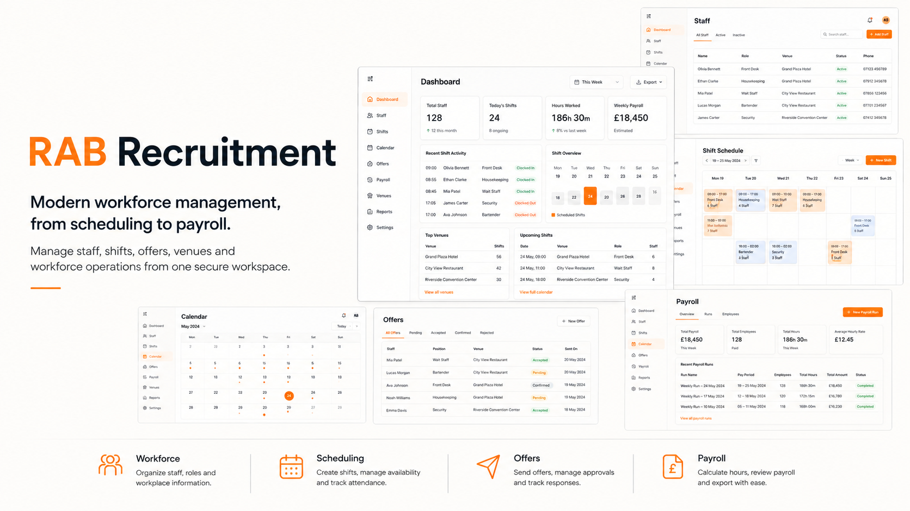
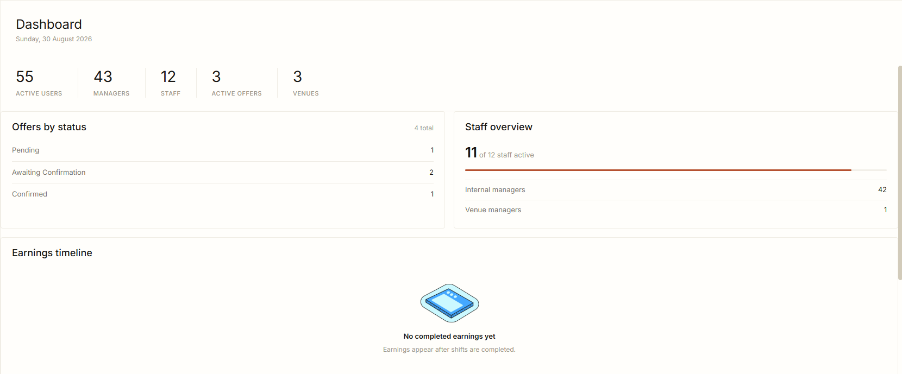
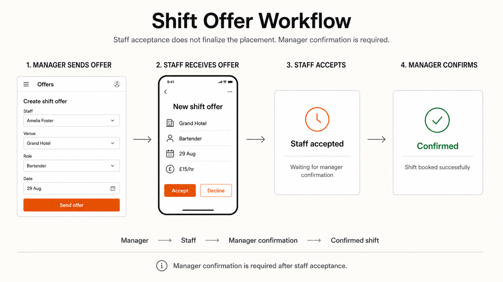
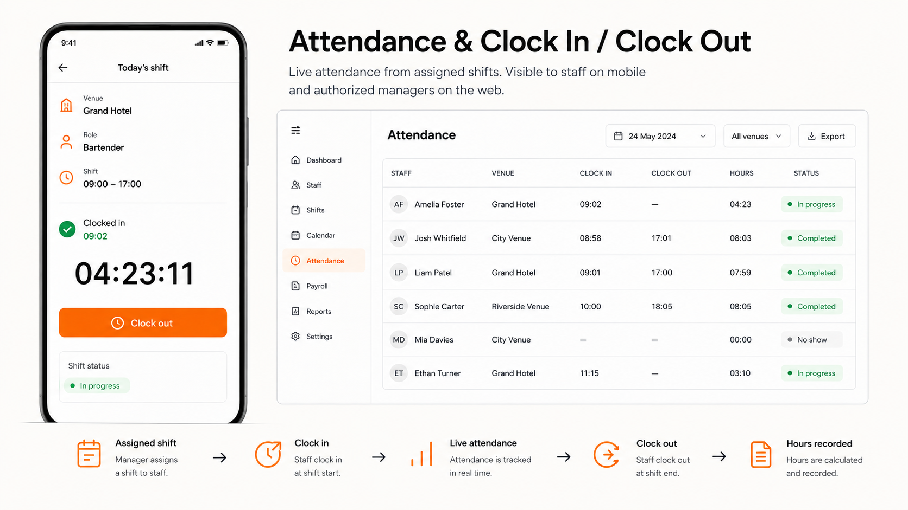
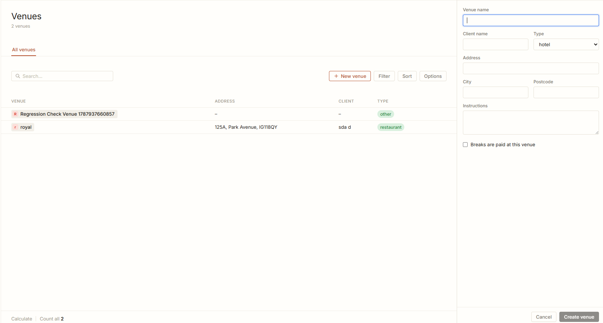

<div align="center">

# RAB Recruitment

Modern workforce management, from scheduling to payroll.

Manage staff, shifts, offers, venues, attendance and payroll from one secure,
workspace-isolated platform.


[](https://github.com/Rabblo06/rab-recurit/actions/workflows/ci-server.yaml)


[Features](#features) • [Architecture](#architecture) • [Getting started](#getting-started) • [Development](#development) • [Security](#security) • [Contributing](#contributing)



</div>

## Overview

RAB Recruitment is a workforce operations platform built for agencies and
managers who staff shifts across multiple venues. Managers create shifts,
send offers to staff, confirm placements, and track attendance and payroll
in one place; staff manage their offers and clock in and out from a
dedicated mobile app.

Each Manager operates inside a private, isolated Workspace — their staff,
venues, shifts, offers and attendance data are never visible to another
Manager's Workspace. Every sensitive operation is enforced server-side
(guard, service and database Row-Level Security), not just hidden in the
UI, and state transitions (offer, shift, attendance, payroll) are validated
against an explicit state machine rather than accepted as free-form input.

The platform is a single NestJS API backed by one PostgreSQL database, with
a React web console for Managers and a Flutter app for staff.

## Features

| Area | What it does |
|---|---|
| **Workforce management** | Staff and Manager records, roles, account status and profile information. |
| **Scheduling** | Create and plan shifts across venues, with a calendar view. |
| **Offers** | Send shift offers to staff and track their status through to confirmation. |
| **Attendance** | Clock-in/clock-out against an assigned shift, with live worked-time tracking. |
| **Venues** | Manage venues, clients, venue type and venue-specific settings. |
| **Payroll** | Calculate worked hours and amounts due from completed attendance. |
| **Audit logging** | Insert-only log of sensitive actions across the platform. |
| **Private workspaces** | Per-Manager data isolation, enforced at the database layer. |

## One workspace for workforce operations

The Dashboard gives a live view of a Manager's Workspace: active users,
staff and venue counts, offers by status, staff activity, and an earnings
timeline once shifts start completing.

<p align="center">
  
</p>

## From open shift to confirmed booking

Staff acceptance does not finalize a placement — a Manager confirmation is
required before a shift is booked:

```text
Manager sends offer
      ↓
Staff receives offer
      ↓
Staff accepts or declines
      ↓
Manager confirms
      ↓
Confirmed booking
```

<p align="center">
  
</p>

## Attendance and working hours

Attendance is tracked from the staff member's assigned shift — clock-in and
clock-out happen on mobile, and are visible to authorized Managers on the
web in real time, including in-progress, completed and no-show states.

<p align="center">
  
</p>

## Venue management

Managers maintain the venues they staff — name, client, address, venue type
and venue-specific rules (such as whether breaks are paid) — and see each
venue's shift and staffing activity.

<p align="center">
  
</p>

## Private workspaces

Each Manager's operational data lives inside their own Workspace:

```text
Manager
└── Workspace
    ├── Staff
    ├── Venues
    ├── Shifts
    ├── Offers
    └── Attendance
```

Workspace is the primary security boundary: a Manager authenticated to one
Workspace cannot read or modify another Workspace's resources, regardless
of what identifiers a request supplies.

## Architecture

```text
                 ┌──────────────────┐        ┌───────────────────┐
                 │   RAB Web App    │        │  RAB Mobile App    │
                 │  React + Vite    │        │  Flutter (Dart)    │
                 └────────┬─────────┘        └─────────┬──────────┘
                          │                             │
                          └──────────────┬──────────────┘
                                         ▼
                               ┌──────────────────┐
                               │     RAB API      │
                               │  NestJS + Redis  │
                               │  (BullMQ worker) │
                               └────────┬─────────┘
                                        ▼
                               ┌──────────────────┐
                               │   PostgreSQL     │
                               │  (Row-Level      │
                               │   Security)      │
                               └──────────────────┘
```

## Technology stack

| Layer | Technology |
|---|---|
| Web | React 18, TypeScript, Vite, React Router, TanStack Query |
| API | NestJS 11, TypeScript, TypeORM |
| Database | PostgreSQL 16, Row-Level Security |
| Queue | Redis, BullMQ |
| Mobile | Flutter, Dart, Provider |
| Email | react-email templates, driver-based sender (logger or SMTP) |
| Testing | Jest, Playwright (web E2E), Maestro (mobile E2E), `flutter_test` |
| Infrastructure | Neon (Postgres), Upstash (Redis), Render (API), Vercel (web) |
| CI | GitHub Actions — per-package lint/test/build, gitleaks, CodeQL, Trivy, RLS coverage gate |

## Repository structure

```text
rab-recurit/
├── packages/
│   ├── rab-server/        # NestJS API + BullMQ worker
│   ├── rab-front/         # React web console (+ venue-portal shell)
│   ├── rab-mobile/        # Flutter staff app
│   ├── rab-shared/        # Shared types, state machines, money/date utils
│   ├── rab-ui/            # Design tokens
│   ├── rab-emails/        # react-email templates
│   ├── rab-docker/        # Local Postgres/Redis + server Dockerfile
│   ├── rab-e2e-testing/   # Playwright (web) + Maestro (mobile) E2E
│   └── rab-utils/         # Scripts, codegen, seeders
├── rab-readme/            # README images
├── SECURITY.md
├── THREAT-MODEL.md
└── README.md
```

## Getting started

**Prerequisites:** Node.js (`^24.5.0`), Yarn via Corepack, PostgreSQL 16+,
Redis, and the Flutter SDK for mobile development.

```bash
git clone https://github.com/Rabblo06/rab-recurit.git
cd rab-recurit
corepack enable
yarn install
```

Bring up Postgres and Redis — either Docker:

```bash
docker compose -f packages/rab-docker/docker-compose.yml up -d
```

or a native install (create a `rab` database, then run the same role
bootstrap by hand):

```bash
psql -U postgres -c "CREATE DATABASE rab;"
psql -U postgres -d rab -f packages/rab-docker/postgres-init/01-roles.sql
```

Configure the API's environment from
[`packages/rab-server/.env.example`](./packages/rab-server/.env.example)
(never commit real values):

| Variable | Purpose |
|---|---|
| `DATABASE_URL` | PostgreSQL connection (migration and runtime roles differ — see the file) |
| `REDIS_URL` | Redis connection for the BullMQ worker |
| `APP_SECRET` | Token signing / encryption key |
| `CORS_ORIGINS` | Allowed web origins |
| `EMAIL_DRIVER` | `LOGGER` (default, no-op) or `SMTP` |
| `APP_URL` | Base URL used in generated links |

Then run migrations and start the app:

```bash
npx nx run rab-server:migration:run
yarn start          # API + web console, concurrently
```

For mobile, from `packages/rab-mobile`:

```bash
flutter pub get
flutter run
```

## Development

| Command | Runs |
|---|---|
| `yarn start` | API + web console together |
| `yarn mobile` | Flutter app via Nx |
| `yarn build` | Build every package |
| `yarn lint` | TypeScript project-wide typecheck (`tsc --noEmit`) |
| `yarn test` | Jest across every package |
| `yarn check-rls` | CI gate — every tenant table has RLS enabled and forced |
| `npx nx run rab-server:worker` | BullMQ background worker |
| `npx nx run rab-server:migration:generate` | Generate a TypeORM migration |

## Testing

- **Unit/integration** — Jest, per package (`rab-server`, `rab-front`,
  `rab-shared`), run via `yarn test` or `npx nx run <package>:test`.
- **Web E2E** — Playwright, `npx nx run rab-e2e-testing:e2e`.
- **Mobile** — `flutter test` from `packages/rab-mobile`; Maestro flows in
  `packages/rab-e2e-testing/mobile/`.
- **CI** — GitHub Actions runs lint, test and build per changed package,
  plus dependency audit, licence allowlisting, `gitleaks` secret scanning,
  CodeQL, Trivy container scanning, and the RLS coverage gate on every
  pull request.

## Security

Security-sensitive behaviour is enforced server-side — guards, service-level
checks and PostgreSQL Row-Level Security — rather than relying on the UI to
hide what a request could otherwise reach. State transitions (offers,
shifts, attendance, payroll, accounts) are validated against an explicit
allow-list, not inferred from client-supplied status values, and sensitive
actions are written to an insert-only audit log.

For vulnerability reporting and secret-rotation procedures, see
[`SECURITY.md`](./SECURITY.md). For the per-feature threat model, see
[`THREAT-MODEL.md`](./THREAT-MODEL.md).

## Contributing

This is a private, proprietary repository — there is no public contribution
process. Team members: branch from `main`, keep changes scoped, run the
relevant `lint`/`test`/`build` targets before opening a pull request, and
follow the working agreements in [`CLAUDE.md`](./CLAUDE.md).

## License

RAB Recruitment is proprietary, all-rights-reserved software. See
[`LICENSE`](./LICENSE).
