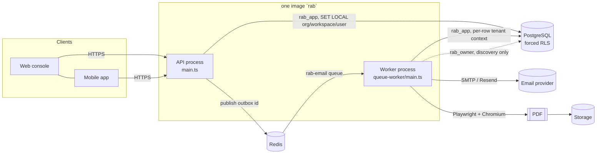
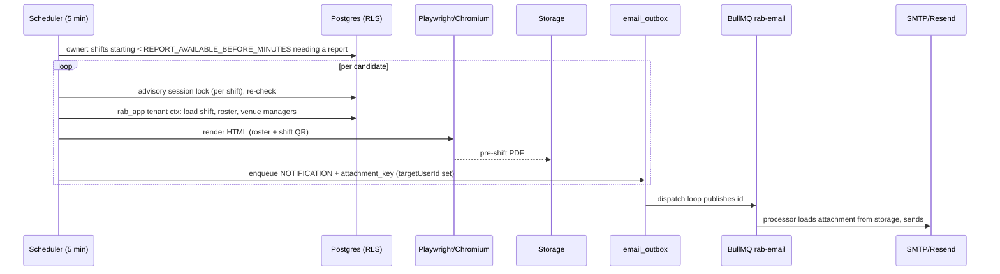

# API + Worker architecture

RAB is **one backend codebase** (`packages/rab-server`) that runs as **two
processes** built from **one Docker image**:

| Runtime | Command | Entry point | Responsibility |
|---|---|---|---|
| **API** | `start.sh` → `node dist/main.js` | `src/main.ts` | HTTP (REST/GraphQL), auth, every synchronous user-facing operation. |
| **Worker** | `node dist/queue-worker/main.js` | `src/queue-worker/main.ts` | Everything that must not run inside a request: email delivery, PDF rendering, scheduled scans, cleanup. |

Both boot the same Nest providers (`engine/` machinery + `modules/` domain
services) — the worker **re-implements no business rule**; it calls the same
services the API calls. There is no worker database: both processes use the
same PostgreSQL and the same Redis.

## Module boundaries

* `engine/` = platform machinery (auth, permissions, tenant context, audit,
  storage, email, environment). **`engine/` never imports `modules/`.**
* `modules/` = staffing domain (staff, venue, scheduling, attendance, …).
* `queue-worker/` = scheduling/orchestration only: it selects *which* rows need
  work, then calls domain services/repositories inside a tenant context.
* Clock-in / clock-out / geofence-exit are **synchronous API operations**. The
  API import graph never reaches `playwright`, the PDF renderer, the HTML
  templates or any `queue-worker/*` job (verified with
  `.audit/prod-readiness/import-boundary.js`; the API process reaches 0 of
  those files).

## Tenant / RLS flow

1. **API request** — `JwtAuthGuard` verifies the token, the guards resolve the
   organisation/workspace/user from the *verified session* (never the body),
   and `TenantContextService.runInTenantContext` opens a transaction with
   `SET LOCAL app.organisation_id / workspace_id / user_id`. Every table is
   `ENABLE`+`FORCE ROW LEVEL SECURITY`; the runtime role `rab_app` is
   `NOBYPASSRLS` and is never the table owner. A query with no context bound
   returns zero rows.
2. **Worker job** — a job is **never trusted to carry authority**:
   * *Discovery* (phase 1) uses the owner connection (`rab_owner`) to find
     candidate `(organisation_id, row id)` pairs across tenants. This is the
     only place the worker uses owner-level access. It reads ids only.
   * *Work* (phase 2) calls `TenantContextService.runScopedForOrg` with the
     candidate's organisation, then **reloads the authoritative row under
     RLS** and re-checks the state before acting. A Redis/BullMQ payload
     (`{emailOutboxId, organisationId}`) is a *hint*: the processor re-reads the
     outbox row inside a tenant context and re-validates it (`revalidate()`),
     so a forged or stale payload cannot reach another tenant's data.
3. A process refuses to start if it is connected as a role that can bypass
   RLS or as the table owner (`engine/utils/assert-runtime-db-role.ts`, used
   by both `main.ts` files).

## Job / queue trust model

* Exactly **one** BullMQ queue: `rab-email`. Everything else is a
  `setInterval` polling loop with advisory locks (`WorkerRuntime.every`), which
  never overlaps itself and tracks in-flight cycles so shutdown can wait for
  them.
* Outbox pattern: business code writes an `email_outbox` row in the same
  transaction as the state change; the dispatch loop (2 s) publishes its id to
  BullMQ (`jobId = outbox id` → idempotent); the processor claims and sends.
  A lost publish self-heals (rows stuck `QUEUED` > 2 min are re-claimed).
* An outbox row **must** carry `target_user_id` — the processor treats a null
  target as "account deleted before delivery" and cancels the row (fail
  closed). The report jobs set it for every recipient.
* Worker heartbeat `rab:worker:heartbeat` lets the API know email delivery is
  available; stats live in `rab:worker:stats`.

## Report / PDF / email flow

The **final timesheet** follows the same shape, driven by
`shift_report.status = 'finalised' AND final_pdf_sent_at IS NULL`. The
"sent" timestamp is claimed with a compare-and-set
(`UPDATE … WHERE final_pdf_sent_at IS NULL RETURNING id`) so at most one worker
ever emits the email for a report.

## Multi-worker concurrency

Any number of workers may run. Safety comes from three layered mechanisms, each
covered by `report-worker-concurrency.integration.spec.ts`:

1. **Session-level advisory lock per report** (`finalise:<shiftId>` /
   per-shift lock, `pg_try_advisory_lock`) on the *direct* (unpooled) owner
   connection — released automatically if the worker dies.
2. **Re-check after taking the lock** (the winner may already have finished).
3. **Compare-and-set claim** for the durable "sent" marker, so even a lock
   failure cannot produce a second email.

Result under N concurrent cycles: one claim, one PDF, one outbox row per
recipient, one final status.

## Graceful shutdown

Both processes call `enableShutdownHooks` / install SIGTERM+SIGINT handlers.
Worker order: stop scheduling new cycles → close the BullMQ worker (waits for
active jobs) → drain in-flight cycles (bounded by a timeout) → close the Nest
context → destroy the owner connection → quit Redis → exit 0. A hard-exit timer
(timeout + 10 s) guarantees the process cannot hang. Note: Windows does not
deliver SIGTERM to Node handlers; shutdown was verified on Linux (Docker).

## Migrations

Exactly one controlled path: `start.sh` on the **API** container runs the
migration command as `rab_owner`, then starts the server. The worker never
migrates. Migrations are never edited after merge.

## Known limitations (see also the release checklist)

* Storage is a local-disk driver. API and Worker are separate containers with
  separate disks, so a PDF written by the worker is **not readable by the API**.
  PDFs are therefore delivered by email attachment (rendered, stored and
  attached inside the worker) — there is no in-console download until an
  S3-compatible driver exists.
* The pre-shift roster PDF is regenerated when the *shift* row changes
  (`shift.updated_at`), not when only staff assignments change.
* Worker discovery temporarily disables RLS on the scanned tables
  (`ALTER TABLE … DISABLE/ENABLE ROW LEVEL SECURITY`) under an advisory lock.
  That statement takes an `ACCESS EXCLUSIVE` lock; on very hot tables it can
  briefly stall writers. Measured in the load test; a `SECURITY DEFINER`
  discovery function is the recommended follow-up.
* The image includes system Chromium (Alpine `apk`), which enlarges it.
* Background geofence exit only works while the mobile app process is alive;
  no iOS project exists yet.
