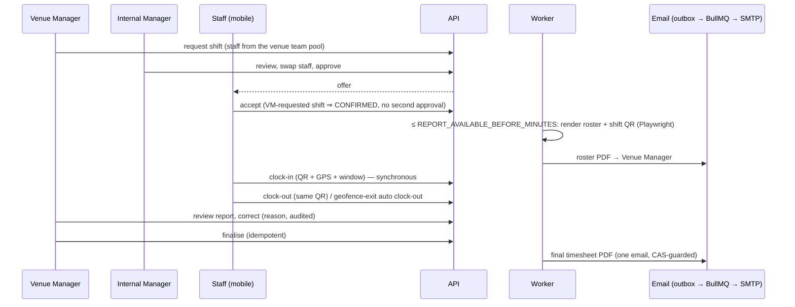

# Attendance lifecycle, evidence and release checklist

This document records what has actually been executed and what has not. Every row
says which kind of evidence backs it. "Real" means the production code path ran;
it does **not** mean a physical device, printer or external mail provider was used
unless the row says so.

## Lifecycle

## The 42-step end-to-end flow

Executed by `attendance-lifecycle-42.integration.spec.ts`: real HTTP API (guards, RLS,
PostgreSQL, Redis), the real worker job functions, the real Playwright renderer, the real
BullMQ email worker, and the real SMTP driver delivering to a **local** SMTP endpoint that
captures the MIME. Server time is never touched — the *shift's* window is moved.
Location and QR values are submitted exactly as the mobile client submits them.

| # | Step | Result |
|---|---|---|
| 01–03 | Internal Manager creates venue (100 m enforced geofence), job role; Venue Manager assigned | PASS |
| 04–05 | Venue Manager builds team pool, submits request (pending approval) | PASS |
| 06 | Request visible to IM, no offer exists yet | PASS |
| 07 | IM swaps Staff 1 → Staff 3 before approving | PASS |
| 08 | Approve: offers to Staff 2 and 3 only | PASS |
| 09–11 | Staff accept ⇒ assignments CONFIRMED without a second approval | PASS |
| 12 | Removed Staff cannot clock in (404) | PASS |
| 13–15 | Report window: nothing generated at 5 h; generated at 100 min; stored PDF is a real PDF with roster + embedded QR | PASS |
| 16–17 | Roster email reaches the Venue Manager over SMTP; attachment byte-identical to stored PDF; outbox `SENT`; no duplicate on second tick | PASS (local SMTP sink) |
| 18 | Too early → 409 `CLOCK_IN_TOO_EARLY` with `availableAt` | PASS |
| 19–23 | QR required; tampered QR; outside geofence; poor GPS accuracy; client-supplied venue location rejected | PASS |
| 24–27 | Clock-in; 5 simultaneous taps ⇒ exactly one attendance; live report | PASS |
| 28–31 | Wrong-QR clock-out rejected; clock-out with the same QR; duplicate clock-out denied; false geofence-exit rejected, genuine exit auto-clocks-out | PASS |
| 32–33 | Report shows methods/hours; other organisation gets 404 on read, correct, finalise | PASS |
| 34–36 | Correction without reason rejected; with reason recalculates; correction row + audit entry | PASS |
| 37–38 | Finalise (double finalise idempotent); correction after finalise → 409 | PASS |
| 39–41 | Worker renders final PDF, stores it, one email; final PDF shows the correction; repeat tick sends nothing | PASS (local SMTP sink) |
| 42 | Final state, correction history, audit trail, tenant isolation of every artefact | PASS |

**Real bug this test found and that is fixed:** the report jobs enqueued emails without
`target_user_id`; the send processor treats that as "account deleted" and cancelled them, so
no roster or timesheet email would ever have been delivered.

## Gate status

| Gate | Status | Evidence / honest limits |
|---|---|---|
| 1 Shared integration login | DONE | `helpers/test-identities.ts`; root cause and guard-not-weakened proof in `docs/testing/integration-test-identities.md`. |
| 2 Security suites execute assertions | DONE | Probe table: every integration suite reached its assertions (2 420+ assertions), zero setup/login failures. |
| 3 Android emulator QA | **PARTIAL — real emulator (Pixel_5 AVD, Android 16), not a physical device** | Login, confirmed shift, too-early message, location rationale, OS location prompt (deny → calm error; allow), camera prompt (deny → error; allow), QR scan from the emulator camera, outside-venue rejection, clock-in, clock-out, offline error + retry, double-tap ⇒ one row. GPS was **simulated** (`adb emu geo fix`). Not done: physical device, background geofence auto-exit on device, iOS (no iOS project). Debug APK builds; `flutter analyze` (7 info-level lints, 0 errors/warnings) and 183 tests pass. |
| 4 42-step flow | DONE (integration) | Table above. Not repeated by hand on a phone end to end. |
| 5 QR from the production PDF | **Generated: YES. Printed physically: NO. Scanned with a real camera: NO (emulator virtual camera only).** | QR is ≈ 81 mm square on A4; decodes at 300/150/96 dpi and through rotation up to 45°, blur and page downscale to 35 % (OpenCV Aruco detector); fails once the QR is ≈ 3 px/module. The image rasterised from the production PDF was shown to the emulator camera and read by the app's scanner; the server accepted it. A physical print + phone scan is still required before go-live. |
| 6 Geofence boundary | **Physical: NO. Simulated GPS: YES** | Exact-radius and one-metre-outside cases in `attendance-abuse-cases` (41 tests) and `venue-geofence-config` (35). Emulator run used simulated coordinates ~1.1 km away (rejected) and on the venue (accepted). |
| 7 Real email + PDF | **BLOCKED for real-provider delivery** | No approved recipient/provider was available; the configured `.env` SMTP was deliberately not used. Verified instead: real SMTP driver → local SMTP endpoint, MIME, `application/pdf`, filename, bytes identical to storage. Real provider delivery: NO. Attached PDF verified against stored bytes: YES (local sink). |
| 8 Corrections / finalisation | DONE | Steps 33–41 + `report-worker-concurrency` (7 tests). |
| 9 Load test | DONE (same-machine baseline) | Below. |
| 10 Decision | see final report | |

## Load test (real HTTP against the compiled build; auth, QR, geofence, throttlers all active)

Simulated phones send distinct `CF-Connecting-IP` values (production reaches the API through
Cloudflare per client). Load generator, PostgreSQL, Redis and API share **one Windows
machine**, so latencies are a baseline, not production numbers. API pool = 10 connections.

| Concurrent clock-ins | 2xx | 5xx | p50 | p95 | p99 | Throughput | API CPU (1 core) |
|---|---|---|---|---|---|---|---|
| 10 | 10 | 0 | ≈ 210–240 ms | ≈ 330–350 ms | ≈ 330–350 ms | ≈ 29 rps | 35–49 % |
| 25 | 25 | 0 | ≈ 270–290 ms | ≈ 325–340 ms | ≈ 340–350 ms | ≈ 72 rps | 58–68 % |
| 50 | 50 | 0 | ≈ 690–700 ms | ≈ 690–700 ms | ≈ 690–700 ms | ≈ 72 rps | 63–86 % |
| 100 | 100 | 0 | ≈ 780–830 ms | ≈ 1.04–1.10 s | ≈ 1.05–1.34 s | ≈ 74–95 rps | 61–74 % |
| 100 **while worker discovery hammers the tables (~1000× production rate)** | 100 | 0 | ≈ 1.4 s | ≈ 2.0 s | ≈ 2.0 s | ≈ 49 rps | 33 % |

Duplicate concurrent clock-in (one staff member, one shift, 10 simultaneous taps): exactly one
`201`, nine `409`, one attendance row, no 5xx. RSS ≈ 150–240 MB. Redis ≈ 7 commands per
clock-in. Deadlocks: 0 in every run after the fix.

Findings from the load test, all fixed:
1. **Worker discovery deadlocked clock-ins** (38/100 failed with 500 before the fix) → bounded
   `lock_timeout` on every discovery transaction (`queue-worker/shared/discovery-lock.ts`).
2. First-clock-in shift status flip was an unconditional `UPDATE` that chained every concurrent
   clock-in behind the shift row lock → compare-and-set on the observed status (no measurable
   latency change on this rig, but strictly fewer writes and lock hops).
3. Raising the DB pool from 10 to 30 did **not** help (slightly worse) on this rig, so the default
   is unchanged; `DB_POOL_MAX` is available for tuning.

## Runtime verification (Docker, Linux)

* API alone, worker alone, and both together against a fresh database: healthy, worker heartbeat
  present, an email requested through the API container was delivered by the worker container
  through the outbox and BullMQ.
* Migrations: only on the API container's start path; worker never migrates.
* Graceful shutdown: SIGTERM during the worker's first PDF render → drained and exited 0, the
  report ended `ready` with its outbox row `SENT` (no half state). SIGTERM during boot of the
  worker or the API (including the migration phase) → exits 0 within ~1 s (was: ignored until
  SIGKILL at 60 s — fixed by the boot guard and a trap in `start.sh`).
* One image, two commands; system Chromium in the image (`apk add chromium`).

## Known limitations

* Local-disk storage: API and worker containers do not share files; PDFs are delivered by email
  attachment only, there is no in-console PDF download.
* The roster PDF is regenerated when the *shift* changes, not when only assignments change.
* Worker discovery still takes a short ACCESS EXCLUSIVE lock (≤ 250 ms bounded stall); the
  structural fix (per-organisation discovery under `rab_app`) is not done.
* Mobile: camera-denied screen has no "open settings" path (location denial does).
* Background geofence exit needs the app process alive; no iOS project.
* Real-provider email, physical print/scan, physical GPS and a physical phone were not exercised.
* Throwaway QA data: see the cleanup note in the final report.

## Release checklist

- [ ] `yarn nx run-many -t build` (real projects) and `yarn check-rls` green
- [ ] Full serial backend suite green (`--runInBand`), assertion probe shows no setup/login failures
- [ ] Migrations applied by the API container only; new migration reviewed (never edited after merge)
- [ ] `EMAIL_DRIVER` set to the real provider **in the deployed environment only**; send one test roster to an approved address and open the attachment
- [ ] Print the roster PDF at 100 % A4 and scan it with a real phone at 0.5–1.5 m in normal light
- [ ] Walk the clock-in/out flow on a physical Android phone at a real venue boundary
- [ ] Confirm each venue has `enforceGeofence` and correct coordinates before its first shift
- [ ] Watch worker logs for "could not take its table locks" — occasional is expected; constant means the tables are too hot for the 5-minute scans
- [ ] `DB_POOL_MAX × API instances` below the database's `max_connections`
