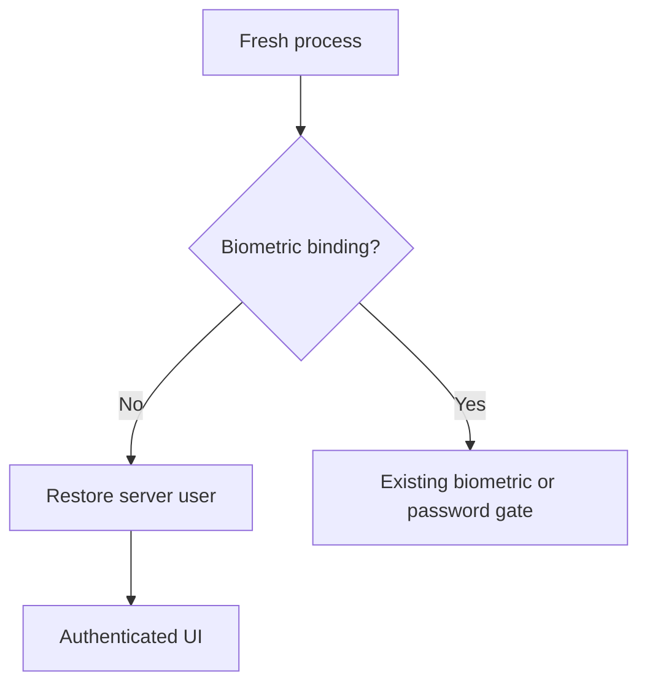
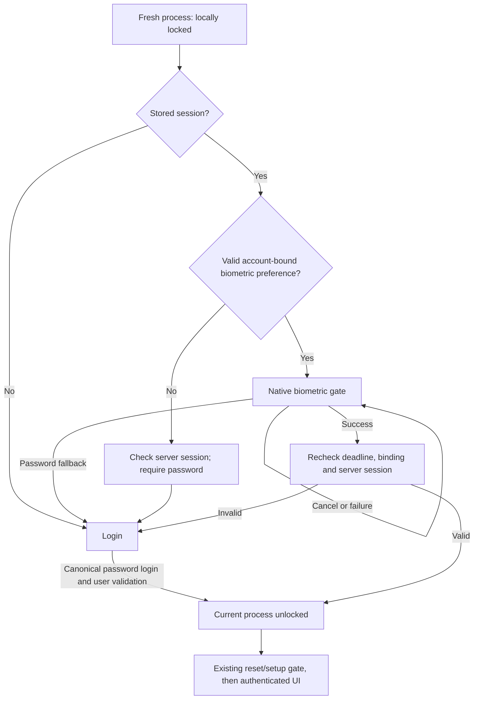

# Mobile Cold-Launch App Lock Fix

## 1. Root cause
AuthProvider._init branched to _restore when no enabled biometric user existed. _restore called refreshUser (/auth/me) and then _phaseAfterUserLoaded, which returned authenticated for a restored non-reset user. Skipping biometrics therefore bypassed local presence on every restart. Root routing relied on this phase. A separate legacy-welcome issue could hide returning-account password content when the welcome flag was absent.

## 2. Previous startup flow

## 3. Corrected startup flow

## 4. Server-session vs app-unlock separation
AppUnlockState is a private in-memory field exposed read-only. canAccessAuthenticatedUi requires a user, authenticated phase and unlocked state. Restoring a user alone does not grant this. Authenticated providers and root routing use this predicate; changing it replaces the MaterialApp navigator so old pushed sensitive pages cannot remain above the login gate.

## 5. Skip-biometric behavior
A password-authenticated process may finish setup with Skip and use the app. A new provider/process starts locked and the absent binding leads to password reauthentication. The durable session is not revoked merely for closing the app.

## 6. Biometric-enabled behavior
Existing ownership, capability and 90-day checks choose biometricLocked or reauthRequired. No authenticated provider is mounted while locked. The existing native local_auth screen, retry and password fallback are retained.

## 7. Cold-launch detection/model
No kill/detached callback or persisted unlocked flag. AppUnlockState.locked is the field initializer. Only successful credential authentication or native success followed by server validation grants unlocked. Warm lifecycle handling remains the existing deadline check; no new background timeout.

## 8. Password unlock
Uses unchanged /auth/login followed by /auth/me through AuthProvider.login. Remembered email is prefilled by the existing form and can be edited for another account. No local comparison, password storage or new endpoint. Existing forced-password-reset and biometric setup gates remain.

## 9. Biometric unlock
Native success alone is insufficient. Existing _canUnlock checks run before/after the prompt and server request, and the returned identity must match the remembered account and stored session owner. Cancellation/failure does not grant unlock. No new biometric stack or template storage.

## 10. 90-day interaction
Existing exact deadline, foreground timer and resumed checks remain. Biometric cannot satisfy expired full-password authentication. No new duration or timestamp policy.

## 11. lastFullAuthenticationAt behavior
Only the existing _afterFreshCredentialAuth password path updates the anchor. The biometric restore path does not write it. Existing confirmation timestamp semantics remain.

## 12. Deep-link/push protection
Current onGenerateRoute routes unknown destinations through _RootGate, including shift/calendar/report/notification route names. Cold route widget tests verify password entry instead of AppShell. The login-return link retains explicit logout semantics. This checkout does not implement arbitrary deferred shift deep-link restoration or a push-routing integration; no claim that a pending destination is replayed after unlock. Navigator invalidation also removes prior sensitive pushed pages when access is lost.

## 13. Network-error behavior
Bootstrap cannot grant unlock on failure. Password/network failure remains locked and allows retry; remembered account/preferences remain. Existing 401/403 token invalidation and biometric retry behavior are preserved. No offline password verification.

## 14. Logout behavior
Existing refresh-family logout request and token clearing remain. Local unlock resets on unauthenticated phase. Process termination performs neither logout nor revocation.

## 15. User-switch isolation
Existing account-owned biometric binding checks and clearing on different-user password login remain. UI/provider identity keys remain; no user may inherit another user's binding.

## 16. Files changed
- lib/core/auth/auth_provider.dart: process-only unlock and locked password restoration.
- lib/app.dart: authenticated access predicate and navigator lifetime.
- lib/features/auth_flow/auth_flow_shell.dart: returning lock excludes first-ever onboarding handoff.
- test/cold_launch_lock_test.dart: process restart/password retry and route gates.
- test/auth_flow_test.dart: replace old automatic-unlock expectation.
- test/biometric_restore_test.dart: explicit locked/unlocked assertions.
- test/biometric_reauth_boundary_test.dart: restart after Skip/disable now requires password; expiry assertions retained.
- test/venue_manager_test.dart: role routing requires password login first.
- Root THREAT-MODEL.md and docs/HANDOFF.md; this report.
Paths above are relative to packages/rab-mobile unless stated. Pre-existing unrelated changes were preserved.

## 17. Tests added/updated
New two-process test covers password+Skip, retained session, cold locked default, wrong password, offline retry, correct password, anchor advancement and logout. Four cold route widget cases cover shift, notifications, calendar and reports with no AppShell before unlock. Existing all-auth/biometric/role suites remain in the full run, including exact Day 90, cancellation/unavailability, session invalidation and user binding. Old restart assertions that expected the reported bypass were changed to require password, not removed.

## 18. Exact test results
381 tests passed in the complete Flutter suite (45 seconds). Two subsequent brace-only analyzer fixes did not change behavior. Evidence: .audit/cold-launch-lock/tests-verified.log.

## 19. flutter analyze
Clean: no issues found (9.2 seconds). Evidence: .audit/cold-launch-lock/analyze-final.log. Normal Android profile build passed (113.5 MB APK), installed successfully on emulator-5554. Build evidence: build-verified.log in the same directory.

## 20. Manual Android verification
Performed: installed the normal lib/main.dart profile APK with adb install -r (no data clear), force-stopped and restarted it on emulator-5554. UI hierarchy confirmed password entry, Sign In and the reauthentication message, with no Calendar navigation. Evidence: .audit/cold-launch-lock/android-cold-lock.xml (local only; may contain remembered email, do not publish raw). This verifies a real process restart and the resulting locked screen, not a full fresh login/Skip cycle or native biometric enable/cancel cycle. Automated tests use mock HTTP/storage and do not constitute real server password or native biometric verification.

## 21. Security invariants preserved
No server, permission, RLS, API credential format, logout-family, biometric binding or deadline changes. No persisted unlock, password or biometric templates. Important source discrepancy: current ApiClient.getAccessToken/storeTokens reads/writes rab.accessToken in FlutterSecureStorage. Thus the supplied brief's memory-only-access-token statement is not true of this checkout. This existing storage policy was neither weakened nor silently rewritten by the local-lock fix. Server Phase 10 behavior is not certified by Flutter tests.

## 22. Remaining work
Complete native end-to-end password+Skip and enable/cancel biometric scenarios with an authorized test account and enrolled emulator/device. Physical iOS QA and release deployment are not performed. Review the existing token-storage discrepancy separately. No backend remediation or new endpoint was required for this fix.
