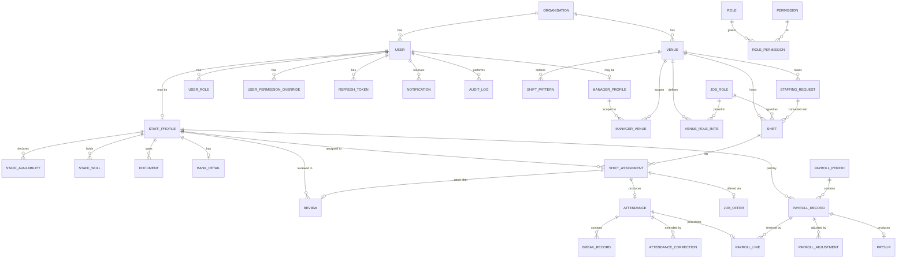

# Rab — Workforce Staffing Platform
## System architecture & delivery plan

**Repo:** `rab` · Nx + Yarn 4 monorepo, `packages/rab-*`
**Convention source:** `Rabblo06/OGCRM` (Twenty fork — Nx 22.5.4, Yarn 4.13.0 hardened, Node 24.5.0, NestJS + TypeORM + GraphQL Yoga, Railway Dockerfile deploy)
**Scope:** one backend, one database, three clients — web console, staff mobile app, venue portal.

> **Decisions locked 2026-08-13:** password hashing = **bcrypt** (mirrors OGCRM).
> Assumptions A1–A12 below = **accepted as written**. M0 scaffold started same day.
>
> **Revised 2026-08-14:** password hashing changed to **argon2id** (`m=19456,
> t=2, p=1`) — bcrypt decision above is superseded, see §5.1. Tenant isolation
> gains a second enforcement layer, **Postgres Row-Level Security**, on top of
> the app-layer `organisationId` scoping already planned — see §5.7. State
> transitions (shift/offer/attendance/payroll) are now explicit, centrally
> enforced tables — see §1.1. None of this changes the stack decided in §0
> below (still Expo/React Native for mobile, still GraphQL Yoga) — it
> hardens the security posture of the plan already in motion, it does not
> replace it.

---

## 0. What carries over from OGCRM — and what deliberately does not

I read the repo. These are the decisions taken from it, so `rab` feels like the same codebase to work in.

**Carried over**

| From OGCRM | Applied in `rab` |
|---|---|
| Nx 22.5.4 with `workspaceLayout.appsDir = packages` | Identical — every package lives in `packages/`, no `apps/`+`libs/` split |
| Yarn 4.13.0, `enableHardenedMode: true`, `enableConstraintsChecks: true`, `nodeLinker: node-modules` | Identical `.yarnrc.yml`; hardened mode is a real supply-chain control, keep it |
| Node `^24.5.0`, `npm: "please-use-yarn"` in engines | Identical |
| NestJS + TypeORM + GraphQL Yoga + Passport-JWT + otplib + BullMQ + ioredis | Identical stack, except password hashing — OGCRM uses bcrypt, `rab` uses **argon2id** (§5.1) |
| `engine/` (platform) vs `modules/` (domain) split inside the server | Identical, and it is the single most useful structural idea in that repo |
| Guard **mixin factories** (`SettingsPermissionGuard(flag)`) rather than per-controller checks | Identical pattern, renamed to `PermissionGuard(flag)` |
| Split token services (access / refresh / login / renew / email-verification / transient) | Identical, plus a `DeviceTokenService` for mobile |
| `SecretEncryptionService` with `APP_SECRET`, including `decryptAndMask` | Identical — this is exactly what bank details and NI numbers need |
| `graphql-hydrate-request-from-token.middleware` / `rest-core.middleware` | Same pattern, renamed `hydrate-request-from-token.middleware` |
| Per-package CI workflows gated by `changed-files.yaml` | Identical — `ci-server`, `ci-front`, `ci-mobile`, `ci-shared`, `ci-ui` |
| Railway `DOCKERFILE` build + `/healthz` + `setup-db` in `startCommand` | Identical shape, Dockerfile at `packages/rab-docker/rab/Dockerfile` |
| Prettier: `singleQuote`, `trailingComma: all`, `endOfLine: lf` | Identical |

**Deliberately dropped**

| Not carried over | Why |
|---|---|
| `twenty-orm` / workspace-metadata engine (dynamic per-tenant schemas, `flat-*` metadata modules) | That exists because Twenty is a no-code CRM where users define their own objects at runtime. A workforce platform has a **fixed domain schema** — shifts, attendance, payroll. Inheriting the metadata engine would add months of complexity and make payroll queries un-analysable. `rab` uses plain TypeORM entities and versioned migrations. |
| GraphQL-only surface | Mobile on cellular needs composite endpoints and an offline write queue. `rab` keeps GraphQL for the console and adds a first-class REST surface for mobile (details in §10). |
| `twenty-zapier`, `twenty-website-new`, `twenty-docs`, `twenty-cli`, `create-twenty-app`, `twenty-apps` | Product-surface packages irrelevant here. |
| Billing, SSO/SAML/OIDC, impersonation, admin-panel | Not needed at launch. The auth module is structured so SAML/OIDC can be added later as strategies, exactly as in OGCRM. |
| bcrypt | **Reversed 2026-08-14** — see the banner at the top of this document. `rab` uses argon2id, not OGCRM's bcrypt. |

---

## 1. Assumptions (accepted 2026-08-13)

The brief says never to invent a business rule silently where payroll, compliance, permissions or attendance are affected. These twelve change the schema.

| # | Area | Assumption | Impact if wrong |
|---|---|---|---|
| A1 | Payroll scope | **Gross pay only.** No PAYE/NI/pension/student loan. Payslips show gross; a `net_pence` column exists only for write-back from an external bureau. | Statutory deductions make this HMRC-regulated software (RTI, P60s) — a different product. |
| A2 | Worker status | Agency workers paid **per hour worked**, not salaried. | Removes salary proration entirely. |
| A3 | Holiday pay | Accrued at a configurable rate (UK default **12.07%**), itemised as its own payslip line. Default rolled-up per payslip. | Rolled-up holiday pay must be visibly itemised to be lawful. |
| A4 | Breaks | **Unpaid by default**, deducted from worked time; per-venue/per-role override to paid; staff-recorded breaks beat the scheduled default. | Changes every hours calculation in the system. |
| A5 | Overtime | No automatic premium. Minutes past scheduled end are flagged and paid at standard rate unless a venue rate rule says otherwise. | Premium multipliers are venue-contract specific — revisit if real ones exist. |
| A6 | Rate precedence | `assignment → staff role rate → venue role rate → org default`, **snapshotted onto the assignment at confirmation**, never recalculated. | Without the snapshot, a rate change silently reprices historical work. |
| A7 | Pay period | Weekly, Mon 00:00 – Sun 23:59 `Europe/London`; a shift belongs to the period containing its **scheduled start**. | Overnight/boundary shifts otherwise double-count. |
| A8 | Geofence | **Advisory by default** — out-of-radius clock-in succeeds but is flagged `location_unverified`. Per-venue setting can make it blocking. | Hard-blocking strands staff at sites with poor GPS. |
| A9 | Right to work | Expired RTW **blocks new assignments**, raises an alert, does not auto-cancel confirmed shifts. | Auto-cancelling could strip a venue with no human in the loop. |
| A10 | Missing clock-out | Auto-closed at `scheduled_end + 2h`, status `missing_clock_out`, **never paid without approval**. | Open records otherwise run forever and inflate hours. |
| A11 | Retention | Attendance/payroll/audit kept 6 years. GDPR erasure = **anonymise PII, retain financial records**. | Erasure vs statutory retention must be resolved in schema, not later. |
| A12 | Tenancy | ~~Single tenant per deployment~~ **Revised 2026-08-14: shared database, multiple organisations, isolated by Postgres Row-Level Security** (§5.7) on top of the `organisationId`-scoping already planned. `organisationId` still lives on every table and every query — RLS is the second, DB-level line of defence behind it, not a replacement for it. | Cheap now, near-impossible to retrofit. RLS specifically only earns its keep in a shared-DB model — a true single-tenant-per-deployment setup wouldn't need it. |

### 1.1 State machines

Declared once in `rab-shared/src/state/`, enforced in every service that mutates status, backed by the `CHECK` constraints already in §11's schema. **No endpoint ever accepts a raw `status` value from a client** — mutations name the action (`publishShift`, `acceptOffer`), never `updateShift({ status: 'PUBLISHED' })`. `assertTransition(machine, from, to)` throws a typed `InvalidTransitionError` (→ 409) on an unknown or disallowed transition; unknown state is deny, not pass-through. Keyed on the status enums already defined in `rab-shared/src/types/*` (not renamed to match any external reference — these are `rab`'s own).

```ts
export const SHIFT_TRANSITIONS: Record<ShiftStatusType, ShiftStatusType[]> = {
  draft: ['open', 'cancelled'],
  open: ['offered', 'cancelled'],
  offered: ['partially_filled', 'fully_filled', 'cancelled'],
  partially_filled: ['fully_filled', 'in_progress', 'cancelled'],
  fully_filled: ['confirmed', 'in_progress', 'cancelled'],
  confirmed: ['in_progress', 'cancelled'],
  in_progress: ['completed', 'cancelled'],
  completed: [],
  cancelled: [],
};

// Two-step acceptance (Revised 2026-08-15): staff accepting an offer only
// reserves it for manager review — it does not confirm the shift. The
// manager must separately confirm (claims the seat, runs the capacity race
// and the double-booking check) or reject it. There is no edge from
// `pending` or `staff_accepted` straight to `manager_confirmed` — the state
// machine itself is what makes "staff acceptance does not mean
// confirmation" true, not just which endpoints happen to exist.
export const OFFER_TRANSITIONS: Record<OfferStatusType, OfferStatusType[]> = {
  pending: ['staff_accepted', 'declined', 'expired', 'withdrawn'],
  staff_accepted: ['manager_confirmed', 'manager_rejected'],
  manager_confirmed: [],
  manager_rejected: [],
  declined: [],
  expired: [],
  withdrawn: [],
};

export const ATTENDANCE_TRANSITIONS: Record<AttendanceStatusType, AttendanceStatusType[]> = {
  scheduled: ['clocked_in', 'absent'],
  clocked_in: ['on_break', 'clocked_out', 'missing_clock_out'],
  on_break: ['clocked_in', 'clocked_out'],
  clocked_out: ['under_review', 'approved'],
  missing_clock_out: ['clocked_out', 'disputed'],
  late: ['clocked_out', 'under_review'],
  under_review: ['approved', 'disputed'],
  disputed: ['approved', 'clocked_out'],
  approved: [],           // terminal: reopening requires an attendance_correction row (A-invariant, §11)
  absent: ['disputed'],
};

export const PAYROLL_RECORD_TRANSITIONS: Record<PayrollRecordStatusType, PayrollRecordStatusType[]> = {
  draft: ['pending_approval'],
  pending_approval: ['approved', 'rejected'],
  approved: ['processing'],
  processing: ['paid', 'corrected'],
  paid: ['corrected'],
  rejected: ['draft'],
  corrected: [],
};
```

### 1.2 Abuse-case testing (CI-blocking, from Phase M1 onward)

Every state machine and every RLS policy gets a named, CI-blocking test that proves the *denial*, not just the happy path. Minimum set once auth + tenancy exist:

```
Staff A → Staff B's payslip / attendance / bank details      → 404 (not 403 — see below)
Staff A → clock into a shift they weren't offered             → 403
Staff A → accept an offer belonging to Staff B                → 404
Staff → confirm their own staff_accepted offer                 → 403 (lacks OFFER_CONFIRM; state machine has no pending/staff_accepted -> manager_confirmed edge either way)
Manager → confirm an offer still `pending` (staff hasn't accepted)→ 409
Two managers → confirm the same last-seat offer concurrently   → exactly one 200, one 409 SHIFT_FULL
Venue Manager → payroll of any kind, or another venue's shifts → 403 / 404
Manager → approve payroll                                     → 403
Org A user → Org B record by UUID                              → 404
Any request → mutate audit_logs directly                       → DB permission denied
Any request → set `status` directly on a mutation              → 400 (schema rejects it)
Any request → supply `organisationId` in a request body        → 400
Unauthenticated → any non-public endpoint                      → 401
A query executed with no tenant context set                    → 0 rows, not all rows (§5.7)
```

**404, not 403, for records outside the caller's tenant or scope.** A 403 confirms the row exists — that is itself a disclosure. 403 is reserved for "this exists and you may not act on it" within a scope the caller is otherwise allowed to see (e.g. a `MANAGER` trying to approve payroll, a permission they categorically lack — not a tenant boundary).

---

## 2. Repository layout

```
rab/
├── .github/
│   ├── actions/
│   │   ├── yarn-install/            # composite action, cached
│   │   ├── restore-cache/
│   │   └── save-cache/
│   └── workflows/
│       ├── changed-files.yaml       # reusable gate
│       ├── ci-server.yaml
│       ├── ci-front.yaml
│       ├── ci-mobile.yaml
│       ├── ci-shared.yaml
│       ├── ci-ui.yaml
│       ├── ci-e2e.yaml
│       ├── ci-security.yaml         # audit, secret scan, SAST, licence check
│       ├── cd-deploy-main.yaml
│       └── cd-deploy-tag.yaml
├── .yarn/
│   ├── patches/
│   └── releases/yarn-4.13.0.cjs
├── packages/
│   ├── rab-server/                  # NestJS API + worker + commands
│   ├── rab-front/                   # React 18 + Vite — internal console & venue portal
│   ├── rab-mobile/                  # React Native (Expo) — staff app
│   ├── rab-shared/                  # types, permission flags, status enums, date/money utils
│   ├── rab-ui/                      # design tokens + cross-platform primitives
│   ├── rab-emails/                  # react-email templates (offer, payslip, reminders)
│   ├── rab-docker/                  # Dockerfiles, compose, k8s/helm (if ever needed)
│   ├── rab-e2e-testing/             # Playwright (web) + Maestro (mobile) flows
│   └── rab-utils/                   # repo scripts, codegen, seeders
├── .dockerignore
├── .gitattributes
├── .gitignore
├── .nvmrc                           # 24.5.0
├── .yarnrc.yml
├── CLAUDE.md                        # working agreements for AI-assisted development
├── LICENSE
├── README.md
├── jest.preset.js
├── nx.json
├── package.json
├── railway.json
├── tsconfig.base.json
├── vercel.json                      # rab-front
├── yarn.config.cjs                  # Yarn constraints
└── yarn.lock
```

### 2.1 `rab-server` internals

The `engine/` vs `modules/` split from OGCRM, carried over exactly. **`engine/` is platform machinery, `modules/` is the staffing domain.** Nothing in `engine/` may import from `modules/`.

```
packages/rab-server/src/
├── main.ts
├── app.module.ts
├── instrument.ts                     # Sentry/OTel init before anything else
├── command/                          # nest-commander CLI (seeds, backfills, one-offs)
├── queue-worker/                     # BullMQ worker entrypoint
├── database/
│   └── typeorm/
│       ├── core/
│       │   ├── migrations/           # versioned, never edited after merge
│       │   └── core.datasource.ts
│       └── scripts/setup-db.ts       # run by Railway startCommand
├── engine/
│   ├── api/
│   │   ├── graphql/                  # GraphQL Yoga driver, complexity limits, depth limits
│   │   └── rest/                     # REST module for mobile + integrations
│   ├── core-modules/
│   │   ├── auth/
│   │   │   ├── controllers/
│   │   │   ├── dto/
│   │   │   ├── guards/               # is-user-auth-context, is-staff-auth-context,
│   │   │   │                         # is-api-key-auth-context, provider-enabled
│   │   │   ├── services/             # auth.service, sign-in.service, reset-password.service
│   │   │   ├── strategies/           # jwt.auth.strategy (+ saml/oidc later)
│   │   │   ├── token/services/       # access, refresh, login, renew,
│   │   │   │                         # email-verification, transient, device
│   │   │   ├── two-factor/           # otplib TOTP + recovery codes
│   │   │   └── utils/                # auth.util.ts — encryptText / decryptText
│   │   ├── permissions/              # PermissionsService, PermissionFlag, exceptions
│   │   ├── secret-encryption/        # SecretEncryptionService (APP_SECRET, decryptAndMask)
│   │   ├── audit/                    # append-only audit writer + interceptor
│   │   ├── file-storage/             # S3 driver, presigned URLs, MIME allowlist
│   │   ├── pdf/                      # Playwright renderer (payslips)
│   │   ├── email/                    # transactional sender
│   │   ├── push/                     # Expo push driver + token pruning
│   │   ├── message-queue/            # BullMQ abstraction + outbox dispatcher
│   │   ├── redis-client/
│   │   ├── environment/              # typed env config driver + validation on boot
│   │   ├── exception-handler/
│   │   ├── health/                   # /healthz — Railway healthcheck
│   │   ├── i18n/
│   │   ├── metrics/
│   │   └── rate-limit/
│   ├── guards/                       # permission.guard, role.guard, venue-scope.guard,
│   │                                 # staff-self.guard, public-endpoint.guard,
│   │                                 # feature-flag.guard, development.guard
│   ├── decorators/                   # @RequirePermission, @VenueScoped, @PublicEndpoint,
│   │                                 # @AuthUser, @AuthStaff, @AuditAction
│   ├── middlewares/                  # hydrate-request-from-token.middleware
│   ├── interceptors/                 # org-scope, audit, response-shape
│   └── utils/
└── modules/
    ├── organisation/
    ├── staff/                        # profiles, availability, skills, documents
    ├── manager/
    ├── venue/                        # venues, role rates, shift patterns
    ├── scheduling/                   # shifts, assignments, recurrence, conflicts, suggestions
    ├── offer/
    ├── attendance/                   # clocking, breaks, corrections, approval
    ├── payroll/                      # periods, runs, calculation, approval, adjustments
    ├── payslip/
    ├── staffing-request/
    ├── review/
    ├── notification/
    ├── reporting/
    └── search/
```

Every domain module follows the same internal shape, so navigation is muscle memory:

```
modules/attendance/
├── attendance.module.ts
├── controllers/          # REST
├── resolvers/            # GraphQL
├── services/              # business logic — the only place rules live
├── entities/              # TypeORM entities
├── dto/                   # class-validator inputs, GraphQL types
├── jobs/                  # BullMQ processors (auto-close-attendance.job.ts)
├── listeners/             # domain event handlers
├── constants/
├── exceptions/
└── __tests__/
```

### 2.2 `rab-mobile` internals

```
packages/rab-mobile/src/
├── app/                  # expo-router routes: (auth)/, (tabs)/home, calendar, history, profile
├── modules/              # mirrors server domains: offers/, shifts/, clocking/, payslips/
├── api/                  # generated REST client + TanStack Query hooks
├── offline/              # write queue, conflict reconciliation, secure cache
├── location/             # geofence check, permission prompts
├── notifications/        # Expo push registration, deep-link router
├── components/           # thin wrappers over rab-ui primitives
└── theme/                # tokens re-exported from rab-ui
```

### 2.3 `rab-shared` — the reason the two clients cannot drift

```
packages/rab-shared/src/
├── constants/permission-flags.ts     # single source of truth, imported by server + both clients
├── types/                            # ShiftStatus, AttendanceStatus, PayrollStatus, OfferStatus
├── utils/
│   ├── money.ts                      # pence-only arithmetic, no floats
│   ├── duration.ts                   # worked-minutes calculation — ONE implementation
│   └── date.ts                       # Europe/London-aware helpers
└── index.ts
```

`duration.ts` living here is not a tidiness preference. The mobile timer, the attendance console and the payroll engine must all compute worked minutes identically, or staff will see a number that does not match their payslip. One function, one test suite, three consumers.

---

## 3. Root configuration

See `package.json`, `.yarnrc.yml`, `nx.json`, `railway.json` at repo root — kept
in sync with this document. The BullMQ worker deploys as a **separate Railway
service** from the same image with `startCommand: node packages/rab-server/dist/queue-worker/main`.
Payslip rendering must never compete with API request handling for CPU.

---

## 4. System architecture

### 4.1 Stack

| Layer | Choice |
|---|---|
| API | NestJS 11, modular monolith, `engine/` + `modules/` |
| GraphQL | GraphQL Yoga via `@graphql-yoga/nestjs`, code-first, depth + complexity limits |
| REST | Nest controllers under `/rest/v1`, OpenAPI generated — typed mobile SDK |
| DB | PostgreSQL 16, schema `core`, TypeORM 0.3 with **versioned migrations only** (`synchronize: false`) |
| Cache/queue | Redis 7 + BullMQ + ioredis |
| Web | React 18, Vite, TypeScript, TanStack Query + Table, React Hook Form + Zod, Tailwind + Radix |
| Mobile | React Native via Expo (expo-router, expo-secure-store, expo-location, expo-notifications) |
| Files | S3-compatible private buckets, presigned 60s downloads |
| PDF | Playwright Chromium in the worker |
| Email | react-email templates in `rab-emails` — transactional provider |
| Observability | Sentry + OpenTelemetry, structured logs with `requestId`, `actorId`, `organisationId` |

### 4.2 Runtime shape

```
 rab-front (console + venue portal)      rab-mobile (staff)
              │ GraphQL                        │ REST /rest/v1
              └────────────────┬────────────────┘
                                ▼
        ┌────────────────────────────────────────────┐
        │ hydrate-request-from-token middleware       │
        │ JwtAuthGuard → AuthContextGuard →           │
        │ PermissionGuard → VenueScopeGuard           │
        └────────────────────┬─────────────────────────┘
                              ▼
        ┌────────────────────────────────────────────┐
        │  modules/  (services hold ALL rules)        │
        └───────┬──────────────────────────┬───────────┘
                ▼                          ▼
        PostgreSQL (+ outbox)       domain events
                                           ▼
                                 BullMQ worker service
                        push · email · PDF · auto-close · exports · reports
```

Resolvers and controllers are transport adapters only. Both call the same service methods, so a rule can never be enforced on one surface and missed on the other — the specific failure mode that lets a mobile client do something the console forbids.

### 4.3 Event flow

Domain state changes write an `outbox` row **in the same transaction** as the change. A dispatcher polls unprocessed rows and enqueues BullMQ jobs. This is what makes the shift lifecycle reliable: if the transaction commits, the notification will eventually send; if it rolls back, no phantom notification exists.

```
shift.published → offers.dispatch → push + email
offer.accepted  → shift.recompute-status → manager notification
attendance.approved → payroll.eligible
payroll.approved → payslip.generate → storage → staff notification
```

---

## 5. Security architecture

Mirrors OGCRM's model, extended for the things a CRM does not have: money, statutory documents, and a mobile app in strangers' hands.

### 5.1 Authentication

**Token services**, one class per token type, as in OGCRM:

| Service | TTL | Notes |
|---|---|---|
| `AccessTokenService` | 15 min | JWT: `sub`, `organisationId`, `authContext`, `roles[]`, `sessionId`. **Permissions are not embedded** — see 5.2. |
| `RefreshTokenService` | 30 days | Opaque, hashed at rest, rotating, one row per device, `familyId` for theft detection |
| `LoginTokenService` | 5 min | Single-use hand-off after credential/SSO verification |
| `RenewTokenService` | — | Rotation with reuse detection: a replayed token revokes the entire family |
| `EmailVerificationTokenService` | 24 h | Invite and email-change confirmation |
| `TransientTokenService` | 60 s | Presigned document/payslip access, re-authorised on issue |
| `DeviceTokenService` | — | Binds a refresh token to a device id; powers "log out this device" |

Passwords: **argon2id** (`m=19456, t=2, p=1` minimum — revised 2026-08-14, supersedes the earlier bcrypt decision; memory-hard, resistant to GPU/ASIC cracking, and free to choose since no user base exists yet). Reset tokens are single-use, 30-minute TTL, and **invalidate every session on use**; the "email sent" response is identical whether or not the account exists. Login responses are timing- and message-uniform for wrong-email vs wrong-password — the argon2id hash runs even when the account doesn't exist, so the two cases aren't distinguishable by latency. 2FA via `otplib` TOTP with encrypted secrets and one-time recovery codes — **mandatory for anyone holding `payroll.approve` or `user.manage_permissions`**, optional elsewhere.

Login is rate-limited 5/min/IP and 10/hour/account, with progressive lockout. Every attempt writes to `login_history` with IP, user agent and outcome.

### 5.2 Authorisation — four layers, one guard chain

Permissions are **resolved server-side per request**, not read from the JWT. A revoked permission must take effect immediately, not in fifteen minutes.

```ts
// engine/guards/permission.guard.ts — mixin factory, the OGCRM pattern
export const PermissionGuard = (required: PermissionFlagType): Type<CanActivate> => {
  @Injectable()
  class PermissionMixin implements CanActivate {
    constructor(private readonly permissionsService: PermissionsService) {}

    async canActivate(context: ExecutionContext): Promise<boolean> {
      const { user, organisationId } = getAuthContext(context);

      const allowed = await this.permissionsService.userHasPermission({
        userId: user.id,
        organisationId,
        permission: required,
      });

      if (allowed) return true;

      throw new PermissionsException(
        PermissionsExceptionMessage.PERMISSION_DENIED,
        PermissionsExceptionCode.PERMISSION_DENIED,
        { userFriendlyMessage: msg`You do not have access to this. Ask an administrator if you need it.` },
      );
    }
  }
  return mixin(PermissionMixin);
};
```

Used declaratively, never inline in a handler body:

```ts
@Mutation(() => PayrollRun)
@UseGuards(JwtAuthGuard, PermissionGuard(PermissionFlag.PAYROLL_APPROVE))
@AuditAction('payroll.approved')
async approvePayrollRun(@Args('id') id: string, @AuthUser() user: User) { … }
```

The chain, in order:

1. **`JwtAuthGuard`** — valid, unexpired, unrevoked session.
2. **Auth-context guard** — `IsUserAuthContext` (console), `IsStaffAuthContext` (mobile), `IsApiKeyAuthContext` (integrations). A staff token can never reach a console-only mutation even if it holds the permission.
3. **`PermissionGuard(flag)`** — resolved live from `role_permission` ∪ `user_permission_override`, cached in Redis for 30s with explicit invalidation on any grant change.
4. **`VenueScopeGuard` / `StaffSelfGuard`** — row-level: is the target venue in this manager's set? Is this staff record the caller's own?

On top of that, an **org-scope interceptor** injects `organisationId` into every repository query. A developer who forgets the `WHERE` clause gets it anyway — permission bugs should require actively defeating the framework, not merely forgetting something.

### 5.3 Permission flags

Defined once in `rab-shared/src/constants/permission-flags.ts`, imported by server and both clients so the UI hides exactly what the API refuses:

```ts
export const PermissionFlag = {
  STAFF_VIEW: 'staff.view', STAFF_CREATE: 'staff.create', STAFF_EDIT: 'staff.edit',
  STAFF_DEACTIVATE: 'staff.deactivate', STAFF_VIEW_SENSITIVE: 'staff.view_sensitive',
  MANAGER_MANAGE: 'manager.manage', USER_MANAGE_PERMISSIONS: 'user.manage_permissions',
  VENUE_VIEW: 'venue.view', VENUE_CREATE: 'venue.create', VENUE_EDIT: 'venue.edit',
  SCHEDULE_VIEW: 'schedule.view', SCHEDULE_CREATE: 'schedule.create',
  SCHEDULE_PUBLISH: 'schedule.publish', SCHEDULE_BULK: 'schedule.bulk',
  SCHEDULE_OVERRIDE_CONFLICT: 'schedule.override_conflict',
  OFFER_SEND: 'offer.send', OFFER_WITHDRAW: 'offer.withdraw', OFFER_RESPOND: 'offer.respond',
  ATTENDANCE_VIEW: 'attendance.view', ATTENDANCE_EDIT: 'attendance.edit',
  ATTENDANCE_APPROVE: 'attendance.approve', ATTENDANCE_CLOCK_OVERRIDE: 'attendance.clock_override',
  PAYROLL_VIEW: 'payroll.view', PAYROLL_CALCULATE: 'payroll.calculate',
  PAYROLL_APPROVE: 'payroll.approve', PAYROLL_MARK_PAID: 'payroll.mark_paid',
  PAYSLIP_VIEW_OWN: 'payslip.view_own', PAYSLIP_VIEW_ALL: 'payslip.view_all',
  REVIEW_CREATE: 'review.create', STAFFING_REQUEST_CREATE: 'staffing_request.create',
  STAFFING_REQUEST_APPROVE: 'staffing_request.approve',
  REPORT_VIEW: 'report.view', REPORT_EXPORT: 'report.export',
  AUDIT_VIEW: 'audit.view', SETTINGS_EDIT: 'settings.edit',
} as const;
export type PermissionFlagType = typeof PermissionFlag[keyof typeof PermissionFlag];
```

### 5.4 Data protection

- **`SecretEncryptionService`** (OGCRM's, unchanged) encrypts sort code, account number and National Insurance number with `APP_SECRET`. Only `last4` is ever selectable; the encrypted columns carry `{ select: false }` in TypeORM so they cannot leak through a careless `find()`. `decryptAndMask` serves the masked display value.
- **Documents and payslips** live in private buckets keyed `org/{orgId}/{entity}/{uuid}`. There is no public URL. `GET /rest/v1/payslips/:id/download` re-checks ownership, mints a 60-second presigned URL, and writes an audit row.
- **Uploads** pass MIME allowlist, magic-byte verification, 10MB cap and an AV scan hook before the bucket accepts them.
- **Audit log is append-only at the database level**: `REVOKE UPDATE, DELETE ON core.audit_log FROM rab_app`. Not an application convention — a grant.
- **Logging redaction**: a Nest interceptor strips `password`, `token`, `sortCode`, `accountNumber`, `nationalInsurance`, `totpSecret` from every log and Sentry event.

### 5.5 Transport and platform

Helmet, strict CORS allowlist (explicit origins from env, `credentials: true`, never `*`), HSTS, CSRF via double-submit cookie + `SameSite=Strict` for cookie-auth console routes (CORS is not CSRF protection), `class-validator` on every DTO with `forbidNonWhitelisted`. Env vars validated on boot — the process refuses to start with a missing `APP_SECRET` rather than running insecurely.

**Rate limiting** (revised 2026-08-14 with explicit cost classes — per-IP alone is useless against one authenticated user looping an expensive query). Key each Redis token bucket on `{userId}:{organisationId}:{costClass}`, with IP as an *additional* independent bucket:

| Cost class | Operations | Limit |
|---|---|---|
| `AUTH` | login, reset, 2FA verify | 5/15min per account **and** per IP |
| `CHEAP` | reads, lists | 300/min per user |
| `WRITE` | create/update (clock-in 10/min, offer response 20/min within this class) | 60/min per user |
| `EXPENSIVE` | reports, search, bulk scheduling | 10/min per user, 30/min per org |
| `EXPORT` | CSV/PDF export | 5/hour per user, 20/hour per org |
| `UPLOAD` | file upload | 20/hour per user |

Also hard-capped regardless of class: report date ranges (≤ 92 days), export rows (≤ 10,000, else async job + emailed link), bulk scheduling (≤ 200 shifts per call), statement timeout (10s), request timeout (30s).

**GraphQL hard limits** (revised 2026-08-14 to be concrete, all enforced server-side): max depth **7** (`graphql-depth-limit`), max complexity **1000** with each field cost-annotated, introspection and playground disabled in production, request body capped at **100 KB**, aliases capped at **15 per query** (uncapped aliasing is how `a1: shift(id:1) a2: shift(id:2) …` turns one HTTP request into 500 backend calls and walks straight past a per-request rate limiter), and every list field mandates `first ≤ 100` with cursor pagination only.

Error contract, every surface: clients get a stable code and a safe message, never SQL text, stack traces, file paths, env values, ORM entity names, or confirmation that a record the caller can't see exists.

```json
{ "code": "FORBIDDEN", "message": "You do not have access to this resource.", "correlationId": "6f1e…" }
```

Mobile: refresh token in `expo-secure-store` (Keychain/Keystore), optional biometric unlock, certificate pinning on the API domain, screenshot suppression on the payslip and bank-details screens, and a jailbreak/root advisory flag on clock-in records.

### 5.6 `ci-security.yaml`

Runs on every PR: `yarn npm audit --severity high`, Gitleaks secret scan, CodeQL for JS/TS, `yarn constraints` (dependency version drift), licence allowlist check, and Trivy on the built image. Hardened mode already prevents lockfile tampering during install. **Added 2026-08-14:** `tools/check-rls-coverage.ts` (§5.7) runs in this workflow too — merge is blocked if any tenant table lacks a policy.

### 5.7 Row-Level Security — the layer that survives an application bug

**Added 2026-08-14.** §5.2's guard → service → org-scope-interceptor chain is application code — one missed `WHERE organisationId = :org` anywhere in that chain is a cross-tenant leak. RLS is a second, independent enforcement layer at the database itself, so a bug in the app tier degrades to "denied" rather than "leaked." It does not replace §5.2's layers — a request still needs to pass the guard and the service check to reach the query at all. This makes it **five** layers on every sensitive operation, not four: guard → service → org-scope query → **RLS policy** → (for staff/venue-scoped tables) a second, tighter RLS predicate.

**Database roles.** The application never connects as the table owner — if it did, RLS would be silently skipped for every query it runs.

```sql
-- Owner role runs migrations only. The running server never connects as this.
CREATE ROLE rab_owner LOGIN PASSWORD :'owner_pw';

-- Application role: no BYPASSRLS, not the table owner, so policies always apply.
CREATE ROLE rab_app LOGIN PASSWORD :'app_pw' NOBYPASSRLS;
GRANT USAGE ON SCHEMA core TO rab_app;
GRANT SELECT, INSERT, UPDATE, DELETE ON ALL TABLES IN SCHEMA core TO rab_app;

-- Audit log is append-only even for the app role — a grant, not a convention.
REVOKE UPDATE, DELETE ON core.audit_log FROM rab_app;
REVOKE UPDATE, DELETE ON core.attendance_correction FROM rab_app;
```

`tools/check-rls-coverage.ts` is a CI gate (wired into `ci-security.yaml`, §5.6) asserting (a) every table with an `organisation_id` column has `rowsecurity = true` and `FORCE ROW LEVEL SECURITY` set, and (b) `rab_app`'s `rolbypassrls = false`. It runs from M1 onward, the moment the first tenant table lands — no table is allowed to merge without a policy in the same migration (see CLAUDE.md).

**Session context**, fail-closed by construction:

```sql
CREATE FUNCTION core.current_org() RETURNS uuid LANGUAGE sql STABLE AS $$
  SELECT NULLIF(current_setting('rab.organisation_id', true), '')::uuid
$$;
CREATE FUNCTION core.current_uid() RETURNS uuid LANGUAGE sql STABLE AS $$
  SELECT NULLIF(current_setting('rab.user_id', true), '')::uuid
$$;
CREATE FUNCTION core.current_role_name() RETURNS text LANGUAGE sql STABLE AS $$
  SELECT COALESCE(NULLIF(current_setting('rab.role', true), ''), 'NONE')
$$;
```

When `rab.organisation_id` is unset, `current_org()` returns NULL and every `organisation_id = current_org()` predicate evaluates to NULL — the row is filtered out. **Unset context yields zero rows, not all rows.** §1.2's abuse-case suite includes a test that runs a query with no context bound and asserts an empty result — that test is the actual verification of this property, not the sentence above.

**Binding context per request**, via a request-scoped `TenantContextService` in `engine/core-modules/tenant/`:

```ts
async runInTenantContext<T>(ctx: AuthContext, fn: (m: EntityManager) => Promise<T>): Promise<T> {
  return this.dataSource.transaction(async (manager) => {
    // SET LOCAL is transaction-scoped, so a pooled connection can never leak
    // one request's tenant context into the next. Parameterised — never
    // interpolate; these values reach SQL.
    await manager.query(`SELECT set_config('rab.organisation_id', $1, true)`, [ctx.organisationId ?? '']);
    await manager.query(`SELECT set_config('rab.user_id', $1, true)`, [ctx.userId]);
    await manager.query(`SELECT set_config('rab.role', $1, true)`, [ctx.role]);
    return fn(manager);
  });
}
```

Two failure modes this specifically avoids: `SET` (session-scoped, not `SET LOCAL`) leaking across a pooled connection between unrelated requests, and string-interpolated `role = '<value>'` becoming an injection sink — hence `set_config(..., true)` with bound parameters, always, never template interpolation.

**Policy shape**, applied per tenant table starting M1 (example — every future migration that creates a tenant table adds its own):

```sql
ALTER TABLE core.shift ENABLE ROW LEVEL SECURITY;
ALTER TABLE core.shift FORCE ROW LEVEL SECURITY;   -- without FORCE, the table owner still bypasses policies

CREATE POLICY shift_tenant ON core.shift
  USING (organisation_id = core.current_org())
  WITH CHECK (organisation_id = core.current_org());
```

`WITH CHECK` matters as much as `USING` — `USING` alone stops reads but still lets a bug *write* a row into another tenant. Staff- and venue-scoped tables (attendance, payslip, bank_detail) get a second, tighter predicate layered on top, matching the shape in §7's role matrix — e.g. a staff member's own row, or a venue manager's assigned venues only, `OR`'d with the manager/admin roles. `VENUE_MANAGER` is deliberately absent from the payroll and payslip policies at the SQL level, not just the permission-flag level — venue managers must never reach agency pay data even through a bug.

### 5.8 Reporting formats (added 2026-08-14)

**Security finding**, used any time a review turns one up:

```
[CRITICAL|HIGH|MEDIUM|LOW|INFO]
Failure:      <actor> → <action> → <consequence>
Actor:        <role / privilege level>
Location:     <file>:<line>
Root cause:   <the missing control, not the symptom>
Fix:          <specific change, at which layer(s) — guard / service / query / RLS>
Regression:   <the test that would have caught it>
```
CRITICAL = cross-tenant access, privilege escalation, credential exposure, financial impact. HIGH = unauthorised access to sensitive data within a tenant. MEDIUM = real weakness needing realistic conditions. LOW = defence-in-depth gap. INFO = hardening note.

**Security trade-off**, written whenever convenience wins over a stricter control, so it's visible to veto rather than silently shipped:

```
SECURITY TRADE-OFF
Decision:   <what was chosen>
Reason:     <why the stricter option was rejected>
Risk:       <concrete exploit this enables>
Mitigation: <compensating control>
Reversal:   <what it would take to do it properly>
```

**Threat model per feature**, before building anything that touches auth, money, or another person's data: Who can call this? Whose data is involved? What if that identity is compromised, or malicious? What if the request is tampered with? What if two callers race? What if the DB returns data written by a lower-trust actor? What happens when authorisation fails, or the operation fails halfway? `THREAT-MODEL.md` at the repo root answers this for auth, offers, attendance and payroll as each lands (M1–M5); update it in the same PR, not after.

---

## 6. Database ERD



**The one modelling decision everything depends on:** `SHIFT` is *demand* (venue + role + window + `requiredCount`); `SHIFT_ASSIGNMENT` is *one seat*. Bulk scheduling, capacity display (`8/10 filled`), over-offering and the last-seat race are all only tractable because of this split. `JOB_OFFER` hangs off an assignment rather than existing in parallel, so accept/decline mutates one row and cannot desynchronise from the roster.

---

## 7. Role & permission matrix

**✓** full · **◐** scoped (own venues / own record) · **✕** none

| Capability | Super Admin | Manager | Venue Manager | Staff |
|---|:--:|:--:|:--:|:--:|
| View staff list | ✓ | ✓ | ◐ *rostered to their venue, limited fields* | ✕ |
| View staff PII (DOB, address) | ✓ | ✓ | ✕ | ◐ own |
| View bank details | ✓ *masked* | ✕ | ✕ | ◐ own, masked |
| Create / edit staff | ✓ | ✓ | ✕ | ◐ own contact fields |
| Deactivate staff | ✓ | ✓ | ✕ | ✕ |
| Manage managers & permissions | ✓ | ✕ | ✕ | ✕ |
| Create / edit venues | ✓ | ✓ | ◐ instructions & contacts | ✕ |
| View schedule | ✓ | ✓ | ◐ own venue | ◐ own shifts |
| Create / publish shifts | ✓ | ✓ | ✕ | ✕ |
| Bulk & recurring scheduling | ✓ | ✓ | ✕ | ✕ |
| Override a conflict warning | ✓ | ✓ *logged* | ✕ | ✕ |
| Send / withdraw offers | ✓ | ✓ | ✕ | ✕ |
| Respond to an offer | ✕ | ✕ | ✕ | ✓ |
| Raise staffing request | ✓ | ✓ | ✓ | ✕ |
| Approve staffing request | ✓ | ✓ | ✕ | ✕ |
| View attendance | ✓ | ✓ | ◐ *no pay data* | ◐ own |
| Clock in / out | ✕ | ✕ | ✕ | ✓ |
| Manual clock override | ✓ | ✓ *logged* | ✕ | ✕ |
| Approve hours | ✓ | ✓ | ✕ | ✕ |
| Calculate payroll | ✓ | ✓ | ✕ | ✕ |
| **Approve payroll** | ✓ | ◐ *flag + 2FA, never own hours* | ✕ | ✕ |
| Mark paid | ✓ | ✓ | ✕ | ✕ |
| View payslips | ✓ | ◐ *with `payslip.view_all`* | ✕ | ◐ own |
| Review / rate staff | ✓ | ✓ | ◐ *staff who worked their venue* | ✕ |
| View reports | ✓ | ✓ | ◐ own venue | ✕ |
| View audit logs | ✓ | ◐ *read-only* | ✕ | ✕ |
| Edit system settings | ✓ | ✕ | ✕ | ✕ |

**Invariants enforced in code, not policy:** audit rows cannot be updated or deleted by anyone including Super Admin; a user cannot approve a payroll run containing their own hours; Venue Managers never see pay rates, other venues, or internal company data.

---

## 8. Core user flows

### 8.1 Staff onboarding
```
Manager → Users → Staff → Add staff
  identity · employment (role, start date, rate, preferred venues) · compliance (RTW + expiry)
  → status = pending_compliance, user created without password
  → invite email (EmailVerificationTokenService, 24h)
Staff → set password → accept terms → add bank details
Manager verifies RTW → status = active → staff becomes assignable
```
No offer can be sent to a `pending_compliance` staff member. The guard lives in `OfferService`, not the UI.

### 8.2 Shift creation
```
Scheduling → New schedule
 1 Venue      → pulls roles, patterns, instructions, break rules
 2 Date(s)    → single or multi
 3 Role       → pulls venue role rate
 4 Times      → start / end / break (prefilled from pattern)
 5 Headcount  → requiredCount
 6 Staff      → ranked suggestions + search/filter
 7 Review     → conflict panel; blocking issues resolved or overridden with a logged reason
 8 Publish    → status open|offered, offers dispatched via outbox
```

### 8.3 Bulk & recurring scheduling
```
Recurring : venue + role + date range + days of week + times + break + headcount
          → preview every generated shift (editable, removable) → conflict pre-check → draft or publish
Copy      : yesterday | last week | last month | custom range
          → dates shifted, assignments optionally carried, then re-validated
Bulk assign: N shifts × M staff → distributed respecting capacity, conflicts skipped
```
Transactional **per shift, not per batch**: one bad row does not roll back the other 199, and the response itemises every skip with its reason.

### 8.4 Offer acceptance — two steps, and the race

Staff accepting an offer (`pending -> staff_accepted`) is a lightweight
status flip on `job_offer` and `shift_assignment` — it never touches
`shift.filled_count` and never satisfies the GiST exclusion constraint
(only `confirmed` does). It exists purely to hand the offer to the manager
for review; two, five, or every staff member offered a shift can all be
`staff_accepted` at once with no capacity implication. The race — and the
only path to `manager_confirmed` — is the manager's confirm action:

```sql
BEGIN;
  -- capacity check + lock, atomic: a losing confirm affects zero rows
  UPDATE core.shift SET filled_count = filled_count + 1, updated_at = now()
   WHERE id = $1 AND organisation_id = $2 AND filled_count < required_count
   RETURNING filled_count, required_count, pay_rate_pence, status;
  -- zero rows back => 409 SHIFT_FULL, roll back, nothing else runs
  UPDATE core.shift_assignment
     SET status = 'confirmed',
         pay_rate_snapshot_pence = $resolved_rate,   -- A6, re-read from the row just locked above
         confirmed_at = now()
   WHERE id = $2;                                    -- GiST exclusion constraint fires here, if it fires at all
  UPDATE core.job_offer SET status = 'manager_confirmed', manager_confirmed_at = now(), confirmed_by = $manager_id
   WHERE shift_assignment_id = $2;
  -- recompute shift status, insert outbox row
COMMIT;
```

The loser of a race gets `409 SHIFT_FULL` — *"This shift is now full. Another offer may already be confirmed."* Never a duplicate booking, never a silent failure. The manager's alternative to confirming is `staff_accepted -> manager_rejected` (`OfferService.managerReject`) — never claims a seat, so there is no capacity bookkeeping to undo.

### 8.5 Clock in / out
```
Window opens at scheduledStart − 30 min (configurable)
POST /rest/v1/attendance/clock-in { assignmentId, lat, lng, accuracyM, deviceId }
  assignment belongs to caller · status = confirmed · in window · no other open attendance · RTW valid
  distance ≤ venue.geofenceRadiusM → locationVerified = true
  else → flagged (A8) or rejected if venue.enforceGeofence
Breaks  : POST /attendance/:id/break/start | /end
Clock out: workedMinutes = (out − in) − unpaidBreakMinutes   → rab-shared/duration.ts
No clock-out by scheduledEnd + 2h → worker auto-closes, flags, notifies both sides (A10)
```
Server timestamps are authoritative. The device timestamp is stored only for offline reconciliation and flagged when it diverges by more than 5 minutes.

### 8.6 Attendance approval
Corrections write an `attendance_correction` row (field, old, new, reason, actor) plus an audit row. Original values are never overwritten in place. Only `approved` attendance is eligible for payroll.

### 8.7 Payroll
```
New run → period + optional venue filter
Transaction: gather approved attendance not already in a finalised run
             per staff → sum minutes, apply rate snapshot, gross, holiday accrual (A3), adjustments
             create payroll_record (pending_approval) + payroll_line per attendance
             set attendance.payrollLocked = true
Approver (payroll.approve, ≠ calculator, ≠ own hours, 2FA verified)
  Approve → enqueue payslip generation
  Reject  → reason required → attendance unlocked → back to review
Mark paid → status = paid, paidAt, paymentReference
```
Corrections after approval never mutate an approved record. They create a `payroll_adjustment` on the next period referencing the original.

### 8.8 Payslip generation
Idempotent on `payrollRecordId`. Renders from the **frozen snapshot** on the payroll record, never a live re-query. Re-runs replace the file and increment `version`, keeping prior versions for audit. Delivered by notification + email; opened via a 60-second presigned URL.

### 8.9 Venue staffing request
```
Venue Manager → Request staff (role, dates, times, headcount, notes) → submitted
Manager → Approve (converts to shifts, request linked) | Modify | Reject (reason required)
Venue Manager sees live progress: requested 8 / assigned 6 / confirmed 5
```

### 8.10 Staff review
14-day window after attendance approval. Five categories 1–5 plus comment and "would rehire". Ratings hidden until ≥3 reviews to avoid single-review skew; recency-weighted mean feeds the suggestion ranking. Written feedback visible to internal managers only, never to other venues.

---

## 9. Screen map

### Web console (`rab-front`)
**Auth** — Login · Forgot password · Reset password · 2FA challenge · Session expired
**Dashboard** — KPI row (total staff, active, today's shifts, clocked in, clocked out, pending offers, pending approvals, payroll this period) · Recent clock-in/out table with filters · Action required · Today's activity · Attendance overview · Upcoming shifts · Venue staffing status
**Users** — Staff list · Staff detail (Overview · Employment · Compliance · Availability · Shifts · Attendance · Earnings · Reviews · Activity) · Add/edit staff · Managers · Manager permissions · Venue managers
**Scheduling** — Calendar (month/week/day/agenda) · Day panel · Shift detail · New schedule wizard · Recurring builder · Copy previous · Bulk assign · Conflict review · Publish confirmation
**Offers** — List (pending/accepted/declined/expired/withdrawn) · Detail · Send · Withdraw
**Attendance** — List · Exceptions · Detail · Correction modal · Bulk approve
**Venues** — List · Detail (Details · Roles & rates · Patterns · Instructions & access · Managers · History · Reviews) · Add/edit · Staffing requests inbox · Request detail
**Payroll** — Periods · New run · Run detail · Staff breakdown · Adjustments · Approval · Payslips · Payslip preview
**Reports** — Hub · Staff · Attendance · Payroll · Venue · Performance · Export centre
**Notifications** — Inbox · Broadcast composer
**Audit logs** — List · Entry detail with before/after diff
**Settings** — Organisation · Users & permissions · Payroll · Scheduling · Notifications · Venues & location · Security · Email templates
**Global** — ⌘K search · Notification tray · Profile menu · 403 · 404 · Error boundary

### Venue portal (same package, restricted shell)
Dashboard (their venue only) · Scheduled staff · Request staff · My requests · Attendance (no pay data) · Reviews · Venue details

### Mobile (`rab-mobile`)
**Auth** — Welcome · Login · Forgot/reset · Set password (invite) · Biometric unlock
**Home** — Greeting + avatar · Upcoming placements · Summary grid (New offers · Booked · Waiting · This week £) · Active shift card with live timer + Check out · Empty state
**Calendar** — Month grid with shift-day highlighting · Day list · Upcoming jobs · Shift detail (address, map link, instructions, uniform, check-in, contact)
**Offers** — List · Detail with expiry countdown · Accept confirmation · Decline with reason
**History** — Completed jobs · Job detail (scheduled vs actual, clock times, breaks, earnings) · Month/venue filter
**Clocking** — Clock in · Active timer · Breaks · Clock out · Failure states (out of range, too early, offline queued)
**Profile** — Personal details · Bank details (masked, re-auth to edit) · Right to work & documents · Payslips · Notifications + preferences · Availability · Help centre · Contact support · Change password · Security & sessions · Log out

---

## 10. API structure

**GraphQL** (`/graphql`) serves the console: nested reads (shift → assignments → staff → reviews) in one round trip, with depth and complexity limits.

**REST** (`/rest/v1`) serves mobile, integrations and webhooks: cacheable, retryable, and queueable offline — properties GraphQL mutations do not give you on a flaky connection.

| Group | Routes |
|---|---|
| `/auth` | `POST /login` `/refresh` `/logout` `/forgot-password` `/reset-password` `/2fa/setup` `/2fa/verify` · `GET /me` `/sessions` · `DELETE /sessions/:id` |
| `/staff` | `GET /` `POST /` `GET|PATCH /:id` `GET|PUT /:id/availability` `GET /:id/shifts` `/attendance` `/earnings` `/reviews` `/documents` `POST /:id/documents` |
| `/managers` | `GET /` `POST /` `PATCH /:id` `PUT /:id/venues` `GET /:id/activity` |
| `/venues` | `GET /` `POST /` `GET|PATCH /:id` `POST /:id/archive` `GET|PUT /:id/rates` `GET /:id/patterns` `GET /:id/staffing-status` |
| `/shifts` | `GET /` `POST /` `GET|PATCH|DELETE /:id` `POST /:id/publish` `/cancel` `GET|POST /:id/assignments` `DELETE /:id/assignments/:aid` `GET /:id/suggested-staff` `POST /:id/check-conflicts` |
| `/schedules` | `POST /recurring` `/recurring/preview` `/copy` `/bulk-assign` `/bulk-publish` |
| `/offers` | `GET /` `POST /` `GET /:id` `POST /:id/accept` `/decline` `/withdraw` `/remind` |
| `/attendance` | `GET /` `/active` `/exceptions` `GET /:id` `POST /clock-in` `POST /:id/clock-out` `/break/start` `/break/end` `PATCH /:id` `POST /:id/approve` `/bulk-approve` |
| `/payroll` | `GET /periods` `POST /periods` `POST /runs` `GET /runs/:id` `/runs/:id/records` `GET /records/:id` `POST /records/:id/adjustments` `POST /runs/:id/approve` `/reject` `/mark-paid` |
| `/payslips` | `GET /` `GET /:id` `GET /:id/download` `POST /:id/regenerate` |
| `/notifications` | `GET /` `/unread-count` `POST /:id/read` `/read-all` `PUT /preferences` `POST /devices` `DELETE /devices/:id` `POST /broadcast` |
| `/reviews` · `/staffing-requests` · `/reports` · `/audit-logs` · `/settings` · `/search` | as per the domain modules; `audit-logs` is read-only by design — no write route exists |

**Mobile composites** (one call per screen, because cellular round trips are the mobile performance budget):
`GET /me/home` · `GET /me/calendar?month=` · `GET /me/history` · `GET /me/offers` · `GET /me/payslips`

`POST /me/sync` accepts the offline write queue: an ordered batch of clock events with client timestamps and idempotency keys, returning per-item accept/reject.

---

## 11. Database schema

Schema `core`. TypeORM entities, `synchronize: false`, migrations only. UUID v4 PKs, `organisationId` on every business table, `timestamptz` UTC everywhere, **all money as `bigint` pence** (revised 2026-08-14 from `int` — `int` tops out at ~£21M, which a rate field never approaches but a running total column shouldn't be trusted to stay under either; `bigint` costs nothing and removes the ceiling as a thing to think about), soft delete via `deletedAt`. Every tenant table gets `FORCE ROW LEVEL SECURITY` and a policy in the same migration that creates it (§5.7) — no exceptions, no follow-up migration.

```sql
-- IDENTITY
organisation(id, name, legal_name, address jsonb, contact jsonb, logo_key,
             timezone default 'Europe/London', settings jsonb, created_at)

"user"(id, organisation_id, email citext, password_hash, first_name, last_name, phone,
       status enum('invited','active','suspended','deactivated'), last_login_at,
       totp_secret_encrypted, totp_enabled bool default false, deleted_at, created_at, updated_at)
  UNIQUE (organisation_id, email) WHERE deleted_at IS NULL

role(id, organisation_id, key, name, is_system bool)
permission(id, key, resource, action, description)
role_permission(role_id, permission_id)                  PK (role_id, permission_id)
user_role(user_id, role_id)                              PK (user_id, role_id)
user_permission_override(user_id, permission_id, effect enum('grant','revoke'))
refresh_token(id, user_id, token_hash, family_id, device_id, user_agent, ip,
              expires_at, revoked_at, replaced_by)       INDEX (user_id, expires_at)
login_history(id, user_id, ip, user_agent, success, created_at)

-- PEOPLE
staff_profile(id, user_id UNIQUE, organisation_id, staff_ref, date_of_birth,
              address jsonb, emergency_contact jsonb,
              employment_status enum('pending_compliance','active','inactive','suspended'),
              start_date, default_pay_rate_pence bigint, ni_number_encrypted,
              preferred_venue_ids uuid[], reliability_score numeric(3,2),
              rating_avg numeric(3,2), rating_count int, notes)
  UNIQUE (organisation_id, staff_ref)   INDEX (organisation_id, employment_status)

manager_profile(id, user_id UNIQUE, organisation_id, type enum('internal','venue'), job_title)
manager_venue(manager_profile_id, venue_id)              PK (manager_profile_id, venue_id)

bank_detail(id, staff_profile_id UNIQUE, account_name,
            sort_code_encrypted, account_number_encrypted, last4 char(4), verified_at)
  -- encrypted columns: TypeORM { select: false }; only last4 leaves the DB

skill(id, organisation_id, name, requires_certificate bool)
staff_skill(staff_profile_id, skill_id, level, certified_until date)
staff_availability(id, staff_profile_id, day_of_week smallint, start_time time, end_time time,
                   is_available bool, effective_from, effective_to)
  INDEX (staff_profile_id, day_of_week)

document(id, organisation_id, staff_profile_id,
         type enum('right_to_work','id','certificate','contract','other'),
         file_key, file_name, mime, size_bytes, issued_on, expires_on,
         status enum('pending','verified','rejected','expired'), verified_by, verified_at)
  INDEX (organisation_id, expires_on) WHERE status = 'verified'

-- VENUES
job_role(id, organisation_id, name, default_rate_pence bigint)
venue(id, organisation_id, name, client_name,
      type enum('hotel','restaurant','warehouse','event','other'), address jsonb,
      lat numeric(9,6), lng numeric(9,6), geofence_radius_m int default 200,
      enforce_geofence bool default false, contact jsonb, instructions, uniform,
      check_in_instructions, parking, access_notes, break_paid bool default false,
      status enum('active','archived'))
  INDEX (organisation_id, status)
venue_role_rate(id, venue_id, job_role_id, pay_rate_pence, charge_rate_pence,
                overtime_multiplier numeric(3,2), effective_from, effective_to)
  UNIQUE (venue_id, job_role_id, effective_from)
shift_pattern(id, venue_id, job_role_id, name, start_time, end_time, break_minutes)

-- SCHEDULING
shift(id, organisation_id, venue_id, job_role_id, staffing_request_id NULL,
      starts_at timestamptz, ends_at timestamptz, break_minutes int default 0,
      required_count int CHECK (required_count > 0),
      pay_rate_pence bigint, charge_rate_pence bigint, notes,
      status enum('draft','open','offered','partially_filled','fully_filled',
                  'confirmed','in_progress','completed','cancelled'),
      recurrence_group_id uuid, created_by, published_at, cancelled_reason)
  CHECK (ends_at > starts_at)
  INDEX (organisation_id, starts_at)   INDEX (venue_id, starts_at)
  INDEX (status) WHERE status IN ('open','offered','partially_filled')

shift_assignment(id, shift_id, staff_profile_id, organisation_id,
                 status enum('offered','staff_accepted','confirmed','declined','rejected',
                             'withdrawn','cancelled','no_show','completed'),
                 pay_rate_snapshot_pence bigint, assigned_by, confirmed_at,
                 period tstzrange NOT NULL)          -- denormalised from shift, kept by trigger
  UNIQUE (shift_id, staff_profile_id) WHERE status <> 'declined'
  EXCLUDE USING gist (staff_profile_id WITH =, period WITH &&)
    WHERE (status IN ('confirmed','completed'))      -- no double-booking; 'staff_accepted' does NOT count — only a manager's confirm does
  INDEX (staff_profile_id, status)

job_offer(id, shift_assignment_id UNIQUE, organisation_id, staff_profile_id,
          status enum('pending','staff_accepted','manager_confirmed','manager_rejected',
                      'declined','expired','withdrawn'),
          sent_at, expires_at, responded_at, decline_reason,
          staff_accepted_at, manager_confirmed_at, manager_rejected_at,
          confirmed_by, rejected_by, rejection_reason, estimated_pay_pence)
  INDEX (staff_profile_id, status)   INDEX (expires_at) WHERE status = 'pending'

-- ATTENDANCE
attendance(id, shift_assignment_id UNIQUE, organisation_id, staff_profile_id, venue_id,
           scheduled_start, scheduled_end, clock_in_at, clock_out_at,
           clock_in_lat, clock_in_lng, clock_in_accuracy_m, clock_in_device,
           clock_out_lat, clock_out_lng, location_verified bool,
           auto_closed bool default false, offline_recorded bool default false,
           break_minutes int default 0, worked_minutes int,
           is_late bool, late_minutes int, early_departure_minutes int, overtime_minutes int,
           status enum('scheduled','clocked_in','on_break','clocked_out','late',
                       'missing_clock_out','absent','under_review','approved','disputed'),
           approved_by, approved_at, payroll_locked bool default false)
  INDEX (organisation_id, scheduled_start)
  INDEX (status) WHERE status IN ('clocked_in','missing_clock_out','under_review')
  UNIQUE (staff_profile_id) WHERE status IN ('clocked_in','on_break')   -- one open shift

break_record(id, attendance_id, started_at, ended_at, minutes, is_paid bool)
attendance_correction(id, attendance_id, field, old_value, new_value, reason, corrected_by, created_at)

-- PAYROLL
payroll_period(id, organisation_id, starts_on, ends_on, status enum('open','locked','closed'))
  UNIQUE (organisation_id, starts_on)
payroll_record(id, payroll_period_id, organisation_id, staff_profile_id,
               total_minutes, total_break_minutes, overtime_minutes,
               gross_pence, holiday_pay_pence, adjustments_pence, total_pence, net_pence NULL,
               status enum('draft','pending_approval','approved','processing','paid',
                           'rejected','corrected'),
               calculated_by, calculated_at, approved_by, approved_at, rejected_reason,
               paid_at, payment_reference, snapshot jsonb)
  UNIQUE (payroll_period_id, staff_profile_id)   INDEX (organisation_id, status)
payroll_line(id, payroll_record_id, attendance_id, shift_id, venue_id,
             worked_minutes, rate_pence, gross_pence, description)
payroll_adjustment(id, payroll_record_id, type enum('bonus','deduction','correction','expense'),
                   amount_pence, reason, references_record_id, created_by)
payslip(id, payroll_record_id, organisation_id, staff_profile_id, reference UNIQUE,
        version int default 1, file_key, generated_at, emailed_at, viewed_at)

-- PLATFORM
staffing_request(id, organisation_id, venue_id, requested_by, job_role_id, requested_date,
                 start_time, end_time, headcount, notes,
                 status enum('submitted','approved','modified','rejected','fulfilled'),
                 handled_by, handled_at, rejection_reason)
review(id, organisation_id, shift_assignment_id, staff_profile_id, venue_id, reviewer_user_id,
       reliability, punctuality, professionalism, work_quality, communication,
       overall numeric(3,2), comment, would_rehire bool)
  UNIQUE (shift_assignment_id, reviewer_user_id)
notification(id, organisation_id, user_id, type, title, message,
             related_entity_type, related_entity_id, channel_state jsonb, read_at, created_at)
  INDEX (user_id, read_at, created_at DESC)
device_token(id, user_id, token, platform enum('ios','android'), last_seen_at)
audit_log(id, organisation_id, actor_user_id, action, entity_type, entity_id,
          before jsonb, after jsonb, ip, user_agent, request_id, created_at)
  INDEX (organisation_id, entity_type, entity_id, created_at DESC)
  -- REVOKE UPDATE, DELETE ON core.audit_log FROM rab_app;
outbox(id, aggregate_type, aggregate_id, event_type, payload jsonb,
       available_at, processed_at, attempts, last_error)
  INDEX (processed_at, available_at) WHERE processed_at IS NULL
system_setting(id, organisation_id, section, key, value jsonb, updated_by)
  UNIQUE (organisation_id, section, key)
```

**Index strategy:** every list screen has a covering index for its default sort and filter; partial indexes cover the hot-but-small sets (pending offers, open attendance, unprocessed outbox); the GiST exclusion constraint enforces the single most important business invariant at the database level rather than in application code, where a future refactor could quietly remove it.

---

## 12. Design system (`rab-ui`)

Tokens are derived from the supplied mobile screens and shared by web and mobile — one file, two renderers.

### Colour
| Token | Hex | Use |
|---|---|---|
| `bg.app` | `#F2F3F1` | App background (the soft off-white in the screens) |
| `bg.surface` | `#FFFFFF` | Cards, tables, sheets |
| `bg.subtle` | `#E9EBE8` | Hover, stripes, skeletons |
| `accent` | `#12735A` | Values, active nav, primary buttons |
| `accent.strong` | `#0C5643` | Pressed / selected calendar day |
| `accent.soft` | `#CFE7DE` | Mint chips, avatar fill, highlighted dates, icon tiles |
| `text.primary` | `#111312` | Headings and figures |
| `text.secondary` | `#6B7270` | Labels, meta, venue lines |
| `text.tertiary` | `#9AA09E` | Placeholders, disabled |
| `border` | `#E3E6E3` | Hairline dividers, card edges |
| `danger` | `#B42318` | Log out, destructive, absent |
| `warning` | `#B54708` | Late, expiring documents, unverified location |
| `info` | `#175CD3` | Draft, informational |

Status colours are semantic tokens consumed by one `StatusBadge` component; no call site ever writes a hex.

### Typography
**Inter** variable throughout; **Inter Display** at ≥24px with −0.02em tracking for the heavy screen titles in the reference. `font-variant-numeric: tabular-nums` is mandatory on timers, currency, hours and every table column — otherwise the shift timer visibly jitters as digits change width.

| Role | Spec |
|---|---|
| Screen title ("Calendar", "Job history") | 30 / 700 / −0.02em |
| Page title (web) | 24 / 600 / −0.015em |
| Section ("Upcoming placements") | 18 / 600 |
| Body | 15 mobile, 14 web / 400 |
| Label / meta | 13 / 400 / `text.secondary` |
| Metric | 28 / 700 tabular (mobile) · 24 (web KPI) |
| Timer | 30 / 600 tabular, accent |

### Space, radius, elevation
4px scale: `2 4 8 12 16 20 24 32 48 64`. Radius `sm 8` · `md 12` · `lg 16` (cards) · `xl 24` (sheets) · `full`. Elevation deliberately flat — `0 1px 2px rgba(17,19,18,.06)` for cards, `0 8px 24px rgba(17,19,18,.10)` for modals. Borders carry the structure, not shadows.

### Components
Button (primary/secondary/ghost/danger × sm/md/lg, `loading`, `disabled`) · Input · Select · Date/Time picker · Async combobox · Card · Table (sortable, sticky header, selection, density toggle) · Modal / Bottom sheet · Dropdown · Tabs · **StatusBadge** · Avatar with initials fallback · Toast · EmptyState · Skeleton · Timer · MetricCard · ConflictList · CapacityBar (`7/10`).

### Platform differences
**Web:** desktop-first, 12 columns, 1440px max, 260px sidebar collapsing to 64px icons under 1280px, tables over cards, keyboard-first (⌘K search, `n` new schedule, arrow keys in the calendar).
**Mobile:** single column, 20px gutters, 4-tab bottom bar (Home · Calendar · History · Profile) with the accent dot under the active tab, 44pt targets, bottom sheets over modals, pull-to-refresh, primary actions in the lower third.

### Motion
150ms state changes, 220ms sheets, 300ms page transitions. One orchestrated moment: the **active shift card** — tabular timer with a slow 2s pulse on the accent ring. `prefers-reduced-motion` kills the pulse.

### Voice
Sentence case. Buttons name their outcome ("Publish schedule" → toast "Schedule published"). Errors state what happened and the fix without apologising: *"This shift is now full. Other shifts at Acme Logistics are in your offers."* Empty states invite action: *"No upcoming placements. New offers appear here as soon as they're sent."*

### Accessibility floor
WCAG 2.2 AA on all text and badges; status is never colour-only. Visible focus rings, full keyboard operation of the web calendar grid, labelled icon-only controls, Dynamic Type to 200% on mobile.

---

## 13. Edge cases

**Scheduling** — Overnight shifts crossing a BST/GMT change (compute from UTC instants, never wall-clock subtraction) · recurrence across clock changes and bank holidays · 500-shift bulk create where 3 conflict · material edits after acceptance requiring re-confirmation · cancellation after acceptance triggering a compensation adjustment · two managers editing one shift (optimistic concurrency, 409 with a diff).

**Offers** — Last-seat race (§8.4) · RTW expiring between acceptance and shift (nightly sweep flags, does not auto-cancel) · acceptance after the shift started · dead push tokens (in-app remains authoritative; pruned on APNs/FCM feedback).

**Attendance** — No GPS fix or 2km accuracy radius (record `accuracyM`, treat as unverified, not out-of-range) · deliberately shifted device clock · offline clock-out synced two days later (accepted, flagged, forced through manual approval) · two shifts the same day (clock-in requires an explicit `assignmentId`, never "the current shift") · missing clock-out auto-close · no-show marked absent · break longer than the shift or a negative duration after correction · correcting an approved record after payroll lock.

**Payroll** — Attendance approved after its period ran (lands next period, labelled with the original date) · retroactive rate change (snapshot wins) · approver is also the worker (blocked) · payslip job crash mid-run (idempotent) · duplicate run (unique constraint + advisory lock) · rounding (pence and whole minutes, one rounding step at the line) · staff deactivated with unpaid approved hours (still paid, still gets payslip access).

**Access & data** — Venue Manager reaching for another venue's staff (403 at the scope layer *and* absent from search results) · shared payslip URL (60s expiry, re-authorised on issue) · GDPR erasure vs 6-year retention (anonymise PII, keep financial and audit rows) · venue deletion (archive only) · bank details in logs (redaction interceptor + `select: false`).

**Operational** — Notification storm from publishing 200 offers (per-user digest push, individual in-app rows preserved) · 100k-row export (async job, streamed CSV, emailed link) · dashboard at 5k staff (60-second cached materialised view, not live aggregates).

---

## 14. Implementation plan

| Milestone | Scope | Done when |
|---|---|---|
| **M0 — Repo** (1 wk) | `rab` monorepo scaffolded per §2–3: Nx, Yarn 4 hardened, CI workflows incl. `ci-security`, Docker Compose (Postgres + Redis), TypeORM datasource + first migration, env validation, Sentry, `/healthz`, Railway API + worker services, `rab-shared` and `rab-ui` token packages | `yarn start` runs server + front; `yarn mobile` boots Expo; CI green on an empty PR |
| **M1 — Identity & security** (2 wks) | Auth module (login, refresh rotation, reset, sessions, TOTP, argon2id), permissions engine + guard chain, org-scope interceptor, **RLS roles + policies on every table this phase creates**, secret encryption, audit writer + DB grants, staff & manager CRUD, documents with expiry, console shell | Permission-matrix test asserts every role × endpoint from §7; a Venue Manager token cannot list all staff; `check-rls-coverage` passes; the §1.2 abuse-case suite's auth rows pass, including refresh-reuse revoking the whole token family |
| **M2 — Venues & scheduling** (3 wks) | Venues, roles, rates, patterns, availability, shift model, calendar (4 views), single-shift wizard, assignments, conflict engine, capacity display | Overlapping assignment rejected by the GiST constraint, not by app code |
| **M3 — Offers & mobile core** (3 wks) | Offer lifecycle + expiry worker, outbox + notifications + Expo push, mobile auth, Home, Calendar, Offers, race-safe accept | Two staff accepting the last seat concurrently — exactly one wins, the other sees the right message |
| **M4 — Attendance** (2 wks) | Clock in/out, breaks, geofence, offline queue + `/me/sync`, auto-close job, attendance console, corrections + audit, approval | Offer → accept → clock in → clock out → approve, with the mobile timer matching the server to the second |
| **M5 — Payroll & payslips** (3 wks) | Periods, calculation engine, adjustments, segregation-of-duties approval, PDF worker, mobile payslips, email | A real week of attendance produces a correct payslip; rejection returns hours cleanly |
| **M6 — Bulk operations** (2 wks) | Recurring builder + preview, copy previous, bulk assign, bulk approve, set-wide conflict pre-check | 10 housekeepers × Mon–Fri × 4 weeks created and staffed in under two minutes |
| **M7 — Venue portal & reviews** (2 wks) | Restricted venue shell, staffing requests end to end, reviews, performance summary | Automated scope tests prove a Venue Manager sees only their venue |
| **M8 — Reports, suggestions, settings** (2 wks) | Reports + async exports, ranked staff suggestions with visible reasoning, settings, audit viewer, global search | "Recommended staff" explains why each candidate ranks where they do |
| **M9 — Hardening** (2 wks) | Load test at 5k staff / 50k shifts, OWASP ASVS L2 review, pen-test fixes, backup/restore drill, runbooks, data import | p95 dashboard < 500ms; restore-from-backup rehearsed end to end |

**Testing floor per milestone:** unit tests on domain logic (worked minutes, rate resolution, conflict detection, payroll maths, every state-machine transition in §1.1 both valid and invalid); integration tests against a real Postgres with RLS on, including — for every tenant-scoped table — a query run with no tenant context asserting zero rows back; the §1.2 abuse-case suite, extended each milestone with that milestone's new attack surface; contract tests generated from the OpenAPI spec; Playwright (web) and Maestro (mobile) E2E on the two headline journeys — manager schedule→payroll and staff offer→payslip; and the permission-matrix test from M1 re-run in every subsequent milestone.

**Sequencing rule:** M1–M5 is the minimum coherent product. Do not start M6 before M5 works end to end on real data.
